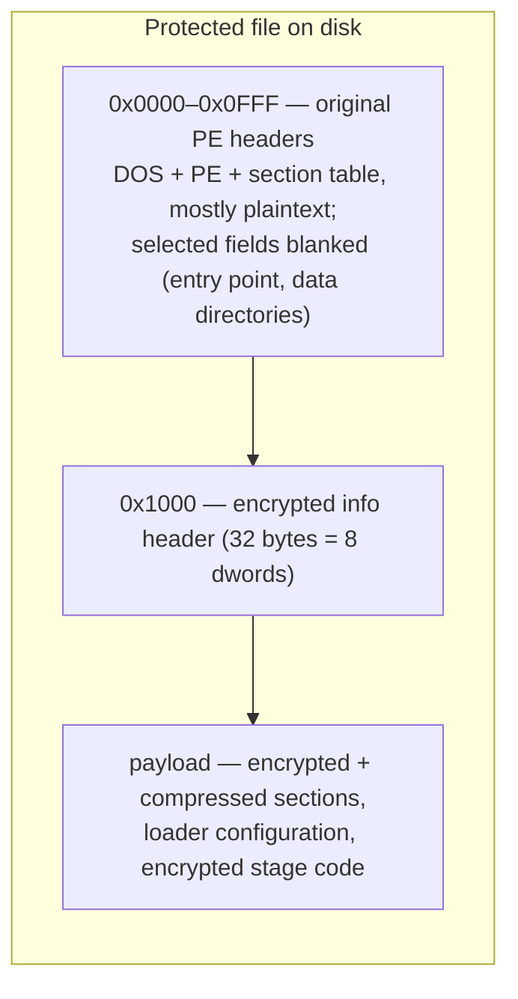

# The protected file format

A protected file is a PE file whose original image has been replaced by an encrypted container. The container keeps the original PE headers (mostly readable) at the front, hides a small parameter block behind a key-derivation function at a fixed offset, and stores everything else — the program's sections and the loader's own code — as encrypted and usually compressed payload.

## Container layout



Three regions matter:

| Region | File offset | Contents |
| --- | --- | --- |
| Header region | `0x0000`–`0x0FFF` | The original PE headers. The DOS/PE signatures, COFF header, optional header, and section table survive in plaintext, but the entry point, several data directories, and the section raw-data pointers are blanked or repurposed. |
| Info header | `0x1000` | 32 bytes: eight dwords encrypted with the key-derivation function below. This is the master parameter block for the whole container. |
| Payload | `0x1020` onward | The encrypted (and Huffman-compressed) section data of the original image, the loader's configuration tables, and the loader's own staged code. |

The split at exactly 4096 bytes (`0x1000`) is constant across every observed build — including the external-companion layout described at the end of this page, which separates the file at this exact boundary.

## The info header and its key derivation

The eight dwords at offset `0x1000` are decrypted with a rolling-key KDF. `info[0]` is stored directly; every later cell is XORed with a key that rolls forward by mixing in the cell value and the square of the index:

```python
def header_kdf(file_data, offset=4096):
    info = [0] * 8
    info[0] = get_u32(file_data, offset)
    k = info[0]
    for i in range(7):
        cell = get_u32(file_data, offset + 4 + 4 * i)
        info[i + 1] = k ^ cell
        k = (i * i) ^ ((k + cell - i) & 0xFFFFFFFF)
    return info
```

The same KDF is used for every build family, EXE and DLL, 32-bit and 64-bit — so one code path recognizes every protected file. The decrypted fields drive the entire unpack:

| Field | Meaning |
| --- | --- |
| `info[0]` | Seed key (stored in plaintext; also feeds the payload cipher) |
| `info[1]` | **Format magic** — identifies the protection build (see below) |
| `info[2]` | Reserved/variant |
| `info[3]` | Base RVA in the reconstructed image where the payload is placed |
| `info[4]` | Payload source offset: the payload begins at `info[4] + 4096` in the file |
| `info[5]` | Total payload size (bytes copied into the image at `info[3]`) |
| `info[6]` | End marker of the decrypted region; the loader's configuration block is located relative to it |
| `info[7]` | Reserved/variant |

The payload transfer is therefore: file range `[info[4] + 4096, info[4] + 4096 + info[5])` → image range `[info[3], info[3] + info[5])`. The first `decrypt_size = info[6] - info[3] + 8192` bytes are decrypted with a rolling XOR chain (see [Data transformation primitives](primitives.md)); the remainder is copied through verbatim. The first 4096 bytes of the file are then overlaid back onto the image as its headers.

### Format magics

`info[1]` stamps the build. Three values are known:

| Magic (LE bytes) | Value | Status |
| --- | --- | --- |
| `KONN` | `0x4E4E4F4B` | Fully documented here |
| `KNKN` | `0x4E4B4E4B` | Identical container algorithm; different build stamp |
| `CUSN` | `0x4E535543` | Known third stamp with an incompatible layout; not covered by this document |

## Recognition and classification

Protected modules do not always carry `.exe`/`.dll` names — renamed copies (for example `.bak`) exist in the wild — so recognition must be content-based. A file is Crackproof-protected when:

1. It is at least 4128 bytes long and has a valid `PE\0\0` signature at `e_lfanew` (`u32@0x3C`).
2. The KDF over offset 4096 yields `info[1] ∈ {KONN, KNKN}`.

Classification then uses ordinary PE fields:

- `IMAGE_FILE_HEADER.Characteristics & 0x2000` (`IMAGE_FILE_DLL`) distinguishes DLL from EXE.
- For DLLs, the COM descriptor (CLR) data directory — entry 14, at optional-header `+96` on PE32 or `+112` on PE32+ — distinguishes managed (.NET) from native.

```python
MAGIC_KONN = 0x4E4E4F4B  # the two supported shell stamps...
MAGIC_KNKN = 0x4E4B4E4B  # ...identical algorithm, different build stamp

def detect(file_data):
    """Return ("exe" | "native-dll" | "managed-dll", magic) for a protected
    file, or None when the file is not protected by this scheme."""
    if len(file_data) < 4128:
        return None
    pe_off = get_u32(file_data, 0x3C)
    if file_data[pe_off:pe_off + 4] != b"PE\0\0":
        return None
    info = header_kdf(file_data)
    if info[1] not in (MAGIC_KONN, MAGIC_KNKN):
        return None

    characteristics = get_u16(file_data, pe_off + 4 + 18)   # IMAGE_FILE_HEADER
    if not characteristics & 0x2000:                        # IMAGE_FILE_DLL
        return ("exe", info[1])

    opt_magic = get_u16(file_data, pe_off + 24)             # 0x10B / 0x20B
    dd_base = 112 if opt_magic == 0x20B else 96
    clr_rva = get_u32(file_data, pe_off + 24 + dd_base + 14 * 8)
    return ("managed-dll" if clr_rva else "native-dll", info[1])
```


Using the wrong data-directory base (96 vs 112) reads the wrong dword and misclassifies a 32-bit native DLL as managed. The optional-header magic must be read first.


## Build families

Protected files observed in the wild vary along four axes. The axes are independent; every combination needs handling.

**Bitness.** PE32+ (optional-header magic `0x20B`, 64-bit) and PE32 (`0x10B`, 32-bit) containers share the header/payload layer but use entirely different configuration layouts, stage structures, and final PE fixups.

**Object kind.** EXE, native DLL, and managed DLL (see classification above). Managed images additionally carry CLR structures (the COR20 header and the BSJB metadata stream) that the packer preserves verbatim in the protected file.

**Configuration layout.** Two generations of the 64-bit loader configuration:

- The **marker layout** (older builds) embeds the byte markers `70 6D 00 00 63 6D 00 00` (`"pm\0\0cm\0\0"` — the loader's two-letter submodule codes) and `00 00 00 40 01 00 00 00` (a `0x40000000, 1` dword pair) in the final loader stage. Every important table is at a fixed offset from these markers.
- The **marker-less layout** (newer builds, including EXE-style shells wrapped around DLLs) omits both markers; the same tables are discovered structurally — by scanning for the embedded bytecode stubs and trial-decrypting candidate descriptor tables until one validates.

**DLL packaging.** Two ways DLLs are protected:

- The **dedicated DLL layout** (older): a DLL-specific container whose configuration block sits at a fixed offset (`keys[6] + 5592`) rather than a scanned anchor.
- The **EXE-style shell** (newer): DLLs are wrapped in the same shell layout as EXEs. The external-companion split below is an instance of this family.

## Locating section data in the file

Section-content descriptors inside the loader tables store offsets relative to a base that is itself complement-encoded in the file at offset `0x1080`:

```
section_data_file_base = (~u32@0x1080) + 0x1000      (32-bit wrapping)
```

A descriptor's `src` field therefore maps to file offset `src + section_data_file_base`. The same formula appears in every build family (it is referenced as both `rebase` and `compress_data_offset` in loader code).

## The external-companion layout (`._` files)

Some builds — observed so far on il2cpp titles — split a protected module into two files:

- **`Foo.dll`** — a thin on-disk **loader stub**. Its code sections are stripped down to a single page (the Crackproof loader itself), but its headers and `.rdata` are intact plaintext.
- **`Foo.dll._`** — the encrypted **companion**, holding the real payload. It contains no plaintext PE structures at all (entropy ≈ 8 bits/byte).

The companion is byte-for-byte the stub's payload region starting at the Crackproof header (offset 4096) onward. At runtime the loader maps `Foo.dll._` and runs the ordinary unpack over it; the module that runs is effectively the splice `stub[..4096] ++ companion`.

The pairing is confirmed by a 32-byte exact match: `stub[4096..4128] == companion[0..32]`. These 32 bytes cover the encrypted info header (key table and magic), so a match proves the companion is this stub's payload and not an unrelated file.

What the stub retains in plaintext matters for later reconstruction:

- The **export directory** (the companion decrypts to ciphertext here; the loader rebuilds exports at runtime from the stub's copy).
- The **TLS directory** — the `IMAGE_TLS_DIRECTORY` struct, its raw-data template, and the data-directory entry, all of which the packer strips from the encrypted payload (see [PE transformations](pe-transformations.md)).
- A real `DllCharacteristics` field and base-relocation table — companion modules are **not** `/FIXED`, unlike the older single-file builds.

For the boot-time view of how this pair is loaded, see [Runtime behavior](runtime-behavior.md); for how the missing pieces are restored into a reconstructed image, see [PE transformations](pe-transformations.md).
