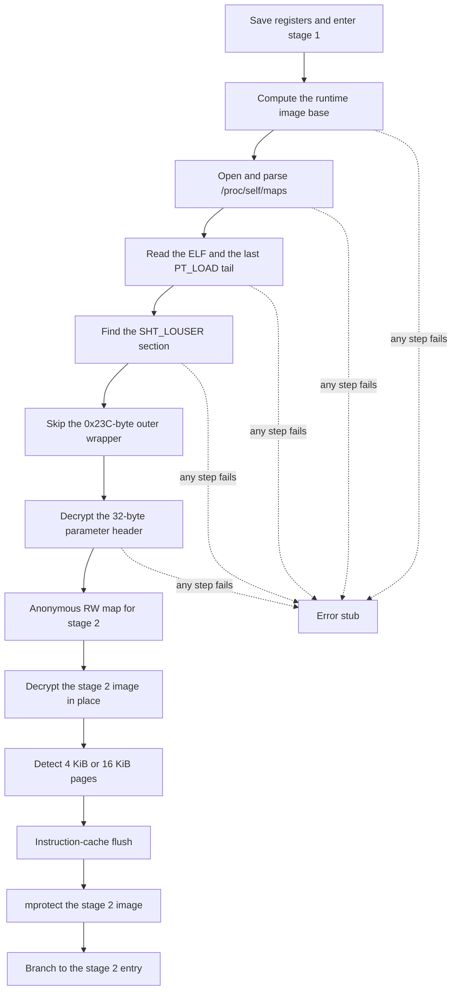

# Stage 1 bootstrap

Stage 1 is the stub that remains in the visible `.text` head. `.init_array[0]` points at it. The stub locates its own file, reads the private section, decrypts the stage 2 image, and transfers control.

## Finding the file

The stub takes its own runtime address with `ADR`, subtracts the link-time offset, and walks `/proc/self/maps` for the mapping that covers that address. The maps path is decrypted into a short buffer and wiped after `open`. A failed maps parse stops the stub.

It then reads the ELF header and enough of the program and section header tables to find the last `PT_LOAD` segment. A second read starts at that segment's file end and covers the tail that holds the private section.

## The private section

Section headers are scanned at `Elf64_Shdr` stride `0x40` for `sh_type == 0x80000000` (`SHT_LOUSER`). After the section start, the stub skips `0x23C` (572) bytes — the outer wrapper documented in [Stage 1 header](../file-format/stage1.md) — and treats the next 32 bytes as the encrypted parameter header.

Two word constants have been observed for the header and payload cipher: `0xbf20165d` and `0xbf189bdd`. Each family uses one of them. The first word is the key and is restored after the 32-byte header is decrypted.

## Handoff to stage 2

The stub maps an anonymous writable region, copies the encrypted stage 2 image, decrypts it with the payload key, probes the page size (4 KiB or 16 KiB), flushes the instruction cache with `DC`/`IC`/`DSB`/`ISB`, and `mprotect`s the image. It then branches to `stage2_base + entry_offset` with:

| Register | Value |
| --- | --- |
| `X0` | Loader context |
| `X1` | Self image base |
| `X2` | Stage 2 base |
| `X3` | Stage 2 size |
| `X4` | Remaining private-section base |
| `X5` | Remaining private-section size |
| `X6` | File-tail mapping base |
| `X7` | File-tail mapping size |

`X6` and `X7` become module `0xD0` in the stage 2 table.
