# Stage 2 interpreter

Stage 2 starts at stream identifier `0xE2`. It allocates a module table, registers itself and the file tail, then interprets a nested record stream. Each interpreter materializes modules, data objects, and the next interpreter.

```mermaid
flowchart LR
    E2["Interpreter 0xE2"] --> F3["Data 0xF3"]
    F3 --> E3["Interpreter 0xE3"]
    E3 --> F4["Data 0xF4"]
    F4 --> E4["Interpreter 0xE4"]
    E4 --> F5["Data 0xF5"]
    F5 --> E5["Interpreter 0xE5"]
    E5 --> F6["Data 0xF6"]
    F6 --> E6["Interpreter 0xE6"]
    E6 --> F7["Data 0xF7"]
    F7 --> E7["Interpreter 0xE7"]
    E7 --> F8["Data 0xF8"]
    F8 --> E8["Interpreter 0xE8"]
    E8 --> M98["Module 0x98"]
```

A direct record with flag `2` isn't a compressed container. Its child stream identifier is `command_id - 0x10`, so `0xF3` feeds interpreter `0xE3`, and the same rule holds through `0xF8` / `0xE8`. That's the same relationship described in [Stage 2 streams](../file-format/stage2-streams.md).

## Module table

Stage 2 maps `0x1800` bytes of anonymous writable memory. Each entry is 24 (`0x18`) bytes, so the table holds 256 slots:

| Offset | Size | Field |
| --- | --- | --- |
| `+0x00` | 4 | Command identifier |
| `+0x04` | 4 | State flags |
| `+0x08` | 8 | Base |
| `+0x10` | 4 | Size |
| `+0x14` | 4 | Reserved |

The first two registrations are:

- `0xE2`: the stage 2 image itself (`X2`, `X3` from stage 1)
- `0xD0`: the file-tail mapping (`X6`, `X7` from stage 1)

Later records call the same registration helper with the command identifier from the decrypted descriptor.

## Record descriptor

Each record is `0x5C` bytes (23 little-endian dwords) after an 8-byte stream header. Observed fields:

| Field | Role |
| --- | --- |
| `command_id` | Identifier written into the module table |
| `flags` | How the payload is materialized and whether callbacks run |
| `image_offset` / `image_size` | Payload relative to the current interpreter input |
| `metadata_offset` / `metadata_size` | Companion load, reloc, or import metadata |
| `id_copy` | Redundant copy of the identifier |
| `init_offset` | Init function relative to the materialized base |
| `entry_offset` | Entry function relative to the materialized base |

`flags & 0x2` borrows a subrange of the parent stream instead of decoding a container. `flags & 0x100` skips init and entry. Other flag bits have been seen; their meaning isn't known.

The interpreter decrypts the stream header, then decrypts descriptors in index order. After each object is registered it calls init (if any) and then entry (if any), unless `0x100` is set. A zero record ends the table.

Stream-header and descriptor ciphers use a per-stream identifier, an 8-byte header, and a GF(2³²) word mix. The constants differ across families; the two observed sets and the shared descriptor walk are on [Word, stream, and record ciphers](../data-transforms/word-and-record.md). Structural checks in [Stage 2 streams](../file-format/stage2-streams.md) stay in force regardless of the constants.

## Layering

One interpreter consumes one input block. That block can hold several records, so one interpreter can produce several objects: executable modules, ordinary data, the next interpreter's code, or a `0xF3`–`0xF8` data object that becomes the next input.

IL2CPP libraries add module `0x0C` and a data-bearing `0xB9` under interpreter `0xE7`. Ordinary native libraries in the same family omit `0x0C` and may carry `0xB9` as an empty record. Module `0x98`, produced by `0xE8`, is the handoff that invokes the restored `.init_array`.
