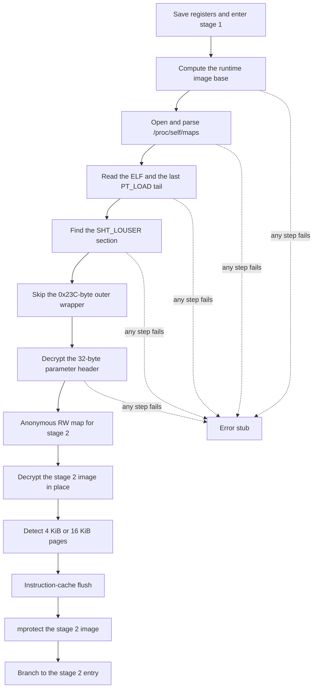

# 第一阶段引导

第一阶段是留在可见 `.text` 头部的桩。`.init_array[0]` 指向它。该桩定位自身文件，读取私有节，解密第二阶段映像，然后移交控制权。

## 定位文件

桩用 `ADR` 取自身运行时地址，减去链接期偏移，再在 `/proc/self/maps` 里找覆盖该地址的映射。maps 路径先解密到短缓冲区，`open` 之后立刻擦掉。解析 maps 失败则停止。

随后读取 ELF 头，以及定位最后一个 `PT_LOAD` 所需的程序头和节头。第二次读取从该段的文件末端开始，覆盖容纳私有节的文件尾。

## 私有节

节头按 `Elf64_Shdr` 步长 `0x40` 扫描 `sh_type == 0x80000000`（`SHT_LOUSER`）。节起点之后，桩跳过 `0x23C`（572）字节，即[第一阶段首部](../file-format/stage1.md)中的外层包装，并把接下来的 32 字节当作加密参数首部。

首部和载荷密码已观察到两种字常量：`0xbf20165d` 与 `0xbf189bdd`。每个家族使用其中之一。第一个字是密钥，32 字节首部解密后会恢复它。

## 移交第二阶段

桩映射一块匿名可写区域，拷入加密的第二阶段映像，用载荷密钥原地解密，探测页大小（4 KiB 或 16 KiB），用 `DC`/`IC`/`DSB`/`ISB` 刷新指令缓存，再 `mprotect` 该映像。然后带着下列寄存器跳到 `stage2_base + entry_offset`：

| 寄存器 | 值 |
| --- | --- |
| `X0` | 加载器上下文 |
| `X1` | 自身映像基址 |
| `X2` | 第二阶段基址 |
| `X3` | 第二阶段大小 |
| `X4` | 剩余私有节基址 |
| `X5` | 剩余私有节大小 |
| `X6` | 文件尾映射基址 |
| `X7` | 文件尾映射大小 |

`X6` 和 `X7` 在第二阶段表里登记为模块 `0xD0`。
