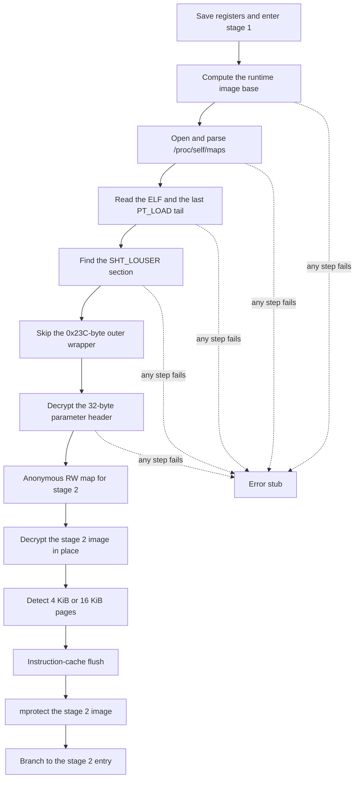

# 第一階段引導

第一階段是留在可見 `.text` 頭部的樁。`.init_array[0]` 指向它。該樁定位自身文件，讀取私有節，解密第二階段映像，然後移交控制權。

## 定位文件

樁用 `ADR` 取自身運行時地址，減去鏈接期偏移，再在 `/proc/self/maps` 裡找覆蓋該地址的映射。maps 路徑先解密到短緩衝區，`open` 之後立刻擦掉。解析 maps 失敗則停止。

隨後讀取 ELF 頭，以及定位最後一個 `PT_LOAD` 所需的程序頭和節頭。第二次讀取從該段的文件末端開始，覆蓋容納私有節的文件尾。

## 私有節

節頭按 `Elf64_Shdr` 步長 `0x40` 掃描 `sh_type == 0x80000000`（`SHT_LOUSER`）。節起點之後，樁跳過 `0x23C`（572）字節，即[第一階段首部](../file-format/stage1.md)中的外層包裝，並把接下來的 32 字節當作加密參數首部。

首部和載荷密碼已觀察到兩種字常量：`0xbf20165d` 與 `0xbf189bdd`。每個家族使用其中之一。第一個字是密鑰，32 字節首部解密後會恢復它。

## 移交第二階段

樁映射一塊匿名可寫區域，拷入加密的第二階段映像，用載荷密鑰原地解密，探測頁大小（4 KiB 或 16 KiB），用 `DC`/`IC`/`DSB`/`ISB` 刷新指令緩存，再 `mprotect` 該映像。然後帶著下列寄存器跳到 `stage2_base + entry_offset`：

| 寄存器 | 值 |
| --- | --- |
| `X0` | 加載器上下文 |
| `X1` | 自身映像基址 |
| `X2` | 第二階段基址 |
| `X3` | 第二階段大小 |
| `X4` | 剩餘私有節基址 |
| `X5` | 剩餘私有節大小 |
| `X6` | 文件尾映射基址 |
| `X7` | 文件尾映射大小 |

`X6` 和 `X7` 在第二階段表裡登記為模塊 `0xD0`。
