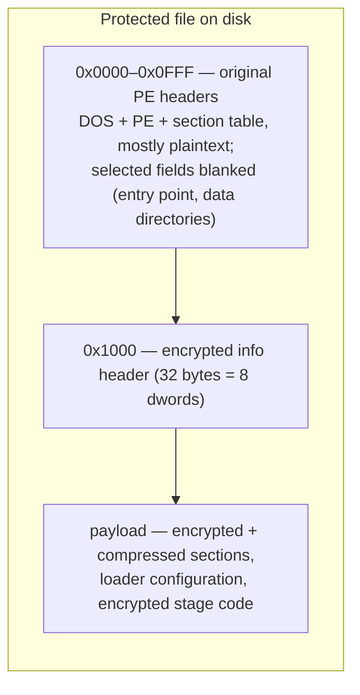

# Container and encrypted header

A protected file is a PE file whose original image has been replaced by an encrypted container. The container keeps the original PE headers (mostly readable) at the front, hides a small parameter block behind a key-derivation function at a fixed offset, and stores everything else — the program's sections and the loader's own code — as encrypted and usually compressed payload.

## Container layout



Three regions matter:

| Region | File offset | Contents |
| --- | --- | --- |
| Header region | `0x0000`–`0x0FFF` | The original PE headers. The DOS/PE signatures, COFF header, optional header, and section table survive in plaintext, but the entry point, several data directories, and the section raw-data pointers are blanked or repurposed. |
| Info header | `0x1000` | 32 bytes: eight dwords encrypted with the key-derivation function below. This is the master parameter block for the whole container. |
| Payload | `0x1020` onward | The encrypted (and Huffman-compressed) section data of the original image, the loader's configuration tables, and the loader's own staged code. |

The split at exactly 4096 bytes (`0x1000`) is constant across every observed build — including the external-companion layout described at the end of this page, which separates the file at this exact boundary.

## The info header and its key derivation

The eight dwords at offset `0x1000` are decrypted with a rolling-key KDF. `info[0]` is stored directly; every later cell is XORed with a key that rolls forward by mixing in the cell value and the square of the index:

```python
def header_kdf(file_data, offset=4096):
    info = [0] * 8
    info[0] = get_u32(file_data, offset)
    k = info[0]
    for i in range(7):
        cell = get_u32(file_data, offset + 4 + 4 * i)
        info[i + 1] = k ^ cell
        k = (i * i) ^ ((k + cell - i) & 0xFFFFFFFF)
    return info
```

The same KDF is used for every build family, EXE and DLL, 32-bit and 64-bit — so one code path recognizes every protected file. The decrypted fields drive the entire unpack:

| Field | Meaning |
| --- | --- |
| `info[0]` | Seed key (stored in plaintext; also feeds the payload cipher) |
| `info[1]` | **Format magic** — identifies the protection build (see below) |
| `info[2]` | Reserved/variant |
| `info[3]` | Base RVA in the reconstructed image where the payload is placed |
| `info[4]` | Payload source offset: the payload begins at `info[4] + 4096` in the file |
| `info[5]` | Total payload size (bytes copied into the image at `info[3]`) |
| `info[6]` | End marker of the decrypted region; the loader's configuration block is located relative to it |
| `info[7]` | Reserved/variant |

The payload transfer is therefore: file range `[info[4] + 4096, info[4] + 4096 + info[5])` → image range `[info[3], info[3] + info[5])`. The first `decrypt_size = info[6] - info[3] + 8192` bytes are decrypted with a rolling XOR chain (see [Data transformation primitives](../data-transforms/README.md)); the remainder is copied through verbatim. The first 4096 bytes of the file are then overlaid back onto the image as its headers.

### Format magics

`info[1]` stamps the build with the format magic:

| Magic (LE bytes) | Value |
| --- | --- |
| `KONN` | `0x4E4E4F4B` |

