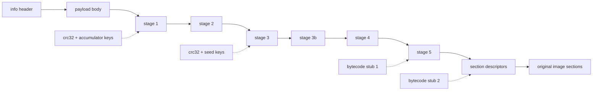

# Stage chain and marker layout

The payload body decrypted by the [rolling XOR chain](../data-transforms/rolling-and-rotation.md#the-rolling-key-family) is not the program — it is the loader's own world: configuration tables, encrypted stage code, and the descriptors that will eventually recover the program's sections. The loader is **self-decrypting**: its code is split into stages, each stage encrypted with a key derived from content that only exists after the previous stage decrypted correctly. Control (or, statically, analysis) must pass through the stages in order; there is no shortcut to the final stage's tables.



## The common stage-decrypt shape

Every stage after stage 2 is decrypted with the same composite, defined by a `(src, src_len, dest, dest_len)` quad in the buffer:

1. **AES-CBC decrypt** `src..src+src_len` with the stage AES schedule (`key_offsets[3]`).
2. **XOR + rotate-right** over the descriptor with the stage key ([xor_ror_dwords, shift 19](../data-transforms/rolling-and-rotation.md#xor--rotate-right-dword-cipher)).
3. If a per-build bytecode stub applies, translate every byte through it.
4. If `src_len != dest_len`, **Huffman/LZ-decompress** `src → dest` with the stage Huffman table (`key_offsets[1]`).

Stages 3–5 are this composite applied to quads at computed offsets with keys from the checksum chain.

## The 64-bit EXE flow (marker layout)

This is the reference flow; the other families are variations on it. It proceeds in nine numbered phases.

### Phase 1–2: header and payload

Derive `info` with the [KDF](../file-format/container-layout.md#the-info-header-and-its-key-derivation), verify the magic, allocate a zeroed image buffer of `SizeOfImage` bytes, run the [payload XOR chain](../data-transforms/rolling-and-rotation.md#the-rolling-key-family) over `decrypt_size = info[6] - info[3] + 8192` bytes, copy the remaining `info[5] - decrypt_size` bytes verbatim, and overlay the first 4096 header bytes.

### Phase 3: the configuration anchor

The configuration block floats between builds, so it is located by scanning the region `[info[6] + 1000, info[6] + 8000)` for the **anchor**: a dword equal to `info[3]`, followed at `+8` by a value slightly less than `info[6]` (delta ≤ `0x1000`, a multiple of `0x200`). A build-generation discriminator follows: the config-version stamp sits at `anchor + 104` in the older layout and `anchor + 112` in the newer one (its top nibble is always `0x4`), yielding `anchor_extra ∈ {0, 8}` — every field from offset 40 onward shifts by that amount.

From the anchor:

- The import directory `(RVA, size)` is restored into the PE header from `anchor + 8` / `anchor + 4`.
- A walk over the `(offset, length)` descriptor table at `anchor + 184 (+extra)` accumulates `xor_acc` — the XOR of every region's `crc32 ^ length` checksum.
- **Stage 1** is unwrapped with `xor_ror_dwords(anchor + 120 (+extra), xor_acc ^ chk1 ^ v, 21)`, where `chk1` is the checksum of the region described at `anchor + 56 (+extra)` and `v` is the dword at `anchor + 20`.

### Phase 4: stage 2

Inside stage 1, the stage-2 quad is the unique 16-byte entry where `d0 == d2`, `d0` lies in the payload range, `d1 > 0x10000`, and `0 < d3 < d1` — call its offset `stage2_off`. Walking back from it, `chk_src_start` is the first position where four consecutive `(src, len)` pairs are all plausible. The stage-2 key is the dword at `chk_src_start - 20`, and stage 2 is unwrapped with shift 19.

Inside stage 2, a 16-byte entry `(1, 0, info[3], 0)` marks `table_start`; the **head** table is at `table_start + 32` and **walk2** at `head - 88`. The two head entries dispatch on their kind dword: kind `1` (or `0x11` — the upper nibble is a build stamp) runs `byte_rotate3` over a descriptor; kind `2` walks a `(src, len, dst, chk)` copy list, moving already-decrypted regions to their working positions. The walk2 entries then yield the four **key offsets** (each `byte_rotate3`-decrypted):

| Slot | Role |
| --- | --- |
| `key_offsets[0]` | Huffman table for **section data** blocks |
| `key_offsets[1]` | Huffman table for **stage** decompression |
| `key_offsets[2]` | AES key schedule for **section data** blocks |
| `key_offsets[3]` | AES key schedule for **stage** decryption |

### Phase 5: stages 3, 3b, 4, 5

Each stage's quad sits at a fixed offset past `stage2_off`, and each key mixes the running `xor_acc`, a fresh checksum, and a seed recovered from the stage decrypted just before:

| Stage | Quad offset | Key composition |
| --- | --- | --- |
| stage 3 | `stage2_off + 88` | `xor_acc ^ chk2 ^ accum` — `accum` is a dword from `chk_src_start - 16` run through four rounds of the [triangular schedule](../data-transforms/checksums.md#the-triangular-key-schedule) |
| stage 3b | `stage2_off + 104` | `xor_acc ^ chk3 ^ v4` — `v4` is the last nonzero dword of stage 3, anchored by the `C3 CC CC CC` (function epilogue + `int3` padding) before it |
| stage 4 | `stage2_off + 136` | `xor_acc ^ chk4 ^ ~v5` — `v5` is the dword 8 bytes before the first `"Virtual..."` API-name string in stage 3b |
| stage 5 | `stage2_off + 216` | `xor_acc ^ chk4 ^ chk5 ^ accum2`, plus bytecode stub 1 |

Stage 4 is where the first embedded **bytecode stub** appears. Its neighbors are the anti-debug API name strings (`IsDebuggerPresent`, `CheckRemoteDebuggerPresent`); the stub itself is located by [trial LFSR-decoding and parsing](../data-transforms/bytecode-transform.md#the-per-build-bytecode-permutation) rather than a fixed offset. The `accum2` seed sits after the last occurrence of the byte pattern `48 EB 01 B9` (plus any `CC` padding), advanced through three triangular rounds. Stage 5 is the only stage decrypted through a bytecode stub — stub 1 is baked into its transform.

### Phase 6: the stage-5 tables

Stage 5 holds the tables that recover the program sections. In the marker layout they hang off two byte markers:

- `70 6D 00 00 63 6D 00 00` (`"pm\0\0cm\0\0"`) — names the `pm`/`cm` submodule codes.
- `00 00 00 40 01 00 00 00` — the "kind marker" (dword pair `0x40000000, 1`).

Relative to the kind marker: **walk4** (the section-load descriptor table pointer) at `−0x20`, **walk3** (a checksum chain) at `−0x18`, and **walk5** (the import-name pointer table) at `+8`. The second **bytecode stub** sits at a discovered offset (marker `+960` in the oldest builds; trial-located otherwise), with the **file checksum chain** pointer `0x58` bytes before it.

- **walk3** is *validation-only*: its 16-byte entries are transiently decrypted, fed into a chained CRC-32 over the original file bytes, and then **restored to their encrypted form** — the chain exists to detect tampering, not to produce output.
- The **file checksum chain** is decrypted permanently in place (16-byte `byte_rotate2` entries until a zero length).
- Stub 2 is LFSR-decrypted and parsed into the op list applied to every section block.

### Phase 7: section recovery

The walk4 table is a positional chain of 16-byte descriptors — each `byte_rotate2`-decrypted in place — of the form `(src, len, dst, plain_len)`, ending on a zero `len`. Per block:

```
copy file[src + section_data_file_base .. +len] → image[dst]
aes_decrypt(dst, len, key_offsets[2])
translate dst..dst+len through bytecode stub 2
if len != plain_len: huffman_decompress(dst → dst, key_offsets[0], len, plain_len)
```

`section_data_file_base` is the complement-encoded base from [the file format page](../file-format/companion-layout.md#locating-section-data-in-the-file). A second walk4 chain then lists regions to zero-fill (the `.bss`-equivalent). Because blocks write disjoint image spans and read only immutable file bytes, this phase is embarrassingly parallel — a property of the format, not of any tool.

### Phase 8: import-name decryption

walk5 entries (20 bytes each) point at encrypted DLL names (`+12`) and thunk chains (`+0` or `+16`). Each name is decrypted with the [string cipher](../data-transforms/lfsr-strings-pages.md#the-import-name-string-cipher), lowercased, and each by-name thunk (bit 63 clear on PE32+) has its hint/name string decrypted and its hint field zeroed. Ordinal imports (bit 63 set) are left alone.

### Phase 9: PE reconstruction

The final phase rebuilds the PE header — section table conversion, the encrypted entry-point/data-directory block, TLS handling, `/FIXED` policy, the code-page scramble, and managed-metadata handling. These are format transformations rather than loader stages, covered in [PE transformations](../pe-reconstruction/README.md).

