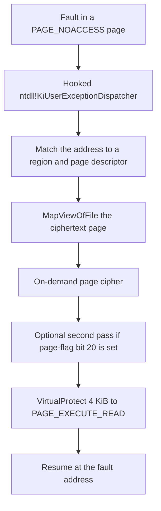

# Page protection and loader code

## Page-level encryption

The strongest runtime layer is optional and per-module. When enabled (`640` then `840`):

1. Executable sections are bulk-decrypted (status `640`).
2. They are then **re-encrypted page by page**, and every page is set to `PAGE_NOACCESS` (status `840`).
3. Execution that reaches a protected page faults; an exception handler decrypts the page on demand and resumes execution.

The exception handling is installed by **patching `ntdll!KiUserExceptionDispatcher`** to jump into the protector's handler, which chains back to normal SEH when it's done. The kernel delivers every usermode exception to this single entry point, so the handler runs ahead of all SEH registrations and is invisible to tools that walk the SEH chain looking for hooks.

A consequence for memory analysis: a naive dump of a page-encrypted module captures only the pages touched since startup (the demand-decrypted working set); the rest is ciphertext or `PAGE_NOACCESS` filler. A complete image requires forcing every page to fault in first. Some builds additionally **scribble**: selected bytes of each decrypted page are XORed with random values once the page is resident, so a raw dump needs de-scribbling. The scribble is a per-build option and not always present. Some page-encrypted modules dump cleanly once every page has been touched.

The page-fault handler doesn't live inside the protected module's image. It ships in a manually mapped support module, `HtdpStub2.dll` (see [Manually mapped helper modules](mapped-modules.md)), which is why handler signatures are absent when only the main module is dumped.

## On-demand page cipher

One observed handler walks this path after a fault:



A table of region descriptors sits in the handler module. Each region is located by comparing the fault address with a base and size. The matching region's page table is an array of 16-byte page descriptors at `region_base + page_table_offset`. The page index is `(fault_address - region_base) >> 12`.

Observed region-descriptor fields:

| Offset | Size | Observed use |
| --- | --- | --- |
| `+0x08` | 8 | Region base |
| `+0x10` | 4 | Region size |
| `+0x20` | 4 | Page-table offset from the region base |
| `+0x24` | 4 | Page count |
| `+0x28` | 8 | Mapping handle passed to `MapViewOfFile` |
| `+0x34` | 4 | Decrypt counter |

Observed page-descriptor fields (16 bytes each):

| Offset | Size | Observed use |
| --- | --- | --- |
| `+0x00` | 4 | Flags. Bit 20 (`0x14`) selects a second transform |
| `+0x04` | 4 | Key material mixed into the page key |
| `+0x08` | 4 | Last `GetTickCount` value |
| `+0x0C` | 2 | Fault count |
| `+0x0E` | 2 | 16-bit field; role not confirmed |

The page key mixes the faulting page address, the low 32 bits of the region base, and the per-page key material. The first transform is a dword cipher over the 4 KiB view:

```python
def demand_page_key(page_va, region_base, key_part):
    return ((page_va + region_base) ^ key_part) & MASK32


def demand_page_decrypt(buf, key):
    count = len(buf) >> 2
    state = ((key << 16) ^ key) & MASK32
    prev = state
    for i in range(count):
        enc = get_u32(buf, i * 4)
        state = rol32((state + i) & MASK32, 3)
        put_u32(buf, i * 4, enc ^ prev ^ state)
        prev = enc
```

`get_u32`, `put_u32`, `rol32`, and `MASK32` are the helpers from [Data transforms](../data-transforms/data-transforms.md). The runnable copy lives in [primitives.py](https://app.gitbook.com/s/8S0xnfw9UP9A2yylicaA/primitives.py).

If page-flag bit 20 is set, a second transform runs on the same 4 KiB. That second function hasn't been reduced to a published formula. The handler then calls `VirtualProtect` on the page with `PAGE_EXECUTE_READ` and resumes execution.

This cipher is a per-module option, the same one that produces the `640` then `840` sequence. It isn't a title-specific extra.

## The loader's own code: polymorphism and decoys

The loader defends its code as aggressively as its data. Techniques observed in the final stage (stage 5) and its bootstrap:

**Polymorphic emit.** The same algorithm appears as many permuted copies. One observed image carries 16 instances of one cipher prologue, differing only in cosmetic junk-jump placement. Disassemblers see 16 unrelated functions; the semantics are identical.

**Anti-disassembly.** Junk bytes after unconditional jumps, jumps into the middle of multi-byte instructions, and return-address arithmetic (for example `call $+5` followed by add/sub of two constants whose difference is the distance to the real continuation, the modified return address then being discarded). Linear and even recursive-descent disassembly desynchronize; one 12.9 KB stage-5 blob decompiles almost entirely to "control flows out of bounds".

**No-op decoy stubs.** The natural entry points are traps for the analyst's patience, not real code. One stub saves all 16 GPRs, performs the VMware backdoor probe, compares the result, and then executes `jne $+2` with a displacement of 0. Both branches reach the same instruction. The stub then restores every register and returns. Its only side effect is the **timing** of the `in` instruction, consumed elsewhere. Another decoy hides its payload behind a trap flag: `pushfq; or [rsp], 0x100; popfq` raises `#DB`. Under normal execution an SEH redirect skips the code after it. Only if a debugger (or naive emulator) swallows the exception and continues does the "hidden" path run, and that path goes nowhere useful.

**Self-modifying metadata.** Stage tables are zeroed after use: markers present in the pre-load image are overwritten by the time the module finishes initializing, so a post-boot dump is missing structures the static file contains.

## Self-loading from disk

The final stage doesn't do reflective in-memory loading. Its API string table contains `GetModuleFileNameW/A`, `CreateFileW`, `CreateFileMappingA`, `MapViewOfFile`, `UnmapViewOfFile`, `GetFileSize`, `GetFullPathNameW/A`, `CloseHandle`, `RtlGetVersion`, `SystemTimeToFileTime`, `Sleep`: file I/O and module-path APIs, with no allocation, protection, or loader APIs. The stage resolves its own on-disk path, maps the protected file as a memory view, and reads the encrypted payload from that view. (This is also why a static analysis can hand the same algorithm the raw file bytes and replay it offline.)

Runtime state is held in a context structure addressed through a reserved register: function pointers at fixed slots, a doubly indirect pointer to the image buffer, and a per-slot table built by an unrolled `lea`-and-store sequence. API addresses are read from the module's own OS-resolved import table. No PEB walk appears anywhere in the stage, so the module relies on the ordinary Windows loader having bound its imports, even though its stored `AddressOfEntryPoint` is junk and the OS never calls its real entry.

The same stage contains its own `.reloc` walker: relocations are applied by the loader (status `655`), not the OS, consistent with the `/FIXED` handling in [PE reconstruction](../loading-and-pe-repair/pe-reconstruction/README.md).
