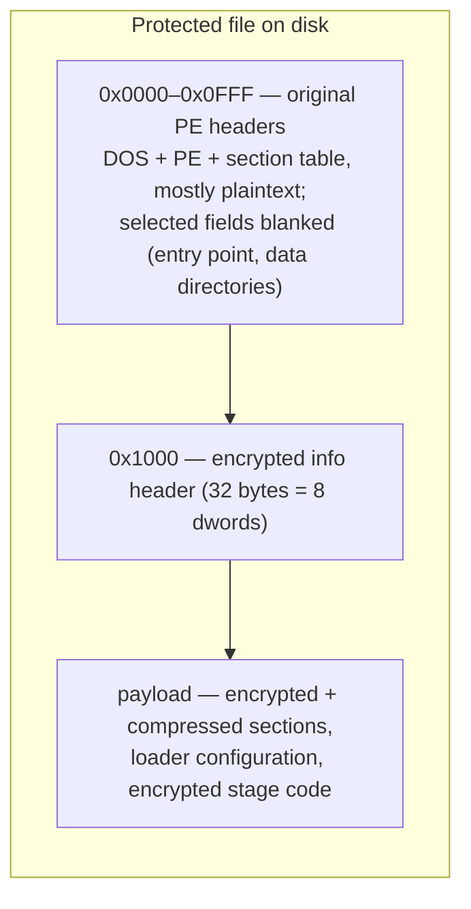

# 容器与加密头

受保护文件是一个原始映像已被加密容器替换的 PE 文件。容器在文件前部保留原始 PE 头（基本可读），在固定偏移处以密钥派生函数隐藏一个小参数块，其余一切——程序的节与加载器自身的代码——都以加密且通常压缩的 payload 形式存储。

## 容器布局



有三个区域需要关注：

| 区域      | 文件偏移              | 内容                                                                |
| ------- | ----------------- | ----------------------------------------------------------------- |
| 头区      | `0x0000`–`0x0FFF` | 原始 PE 头。DOS/PE 签名、COFF 头、可选头与节表以明文幸存，但入口点、若干数据目录与节原始数据指针被抹除或改作他用。 |
| info 头  | `0x1000`          | 32 字节：八个 dword，以下面的密钥派生函数加密。这是整个容器的主参数块。                          |
| payload | info 头之后        | 加密（通常再经 Huffman 压缩）的节数据、加载器表与分阶段加载器代码。滚动 XOR 链的起点是 `info[4] + 4096`，可以晚于 `0x1020`。 |

恰好在 4096 字节（`0x1000`）处的分界在所有已观察构建中恒定——包括[外置伴生体布局](companion-layout.md)，它正是在这个精确边界上把 stub 与 payload 拆开。

## info 头及其密钥派生

偏移 `0x1000` 处的八个 dword 用一个滚动密钥 KDF 解密。`info[0]` 直接存储；后续每个单元都与一个滚动密钥异或，该密钥混入单元值与索引平方向前滚动：

```python
def header_kdf(file_data, offset=4096):
    info = [0] * 8
    info[0] = get_u32(file_data, offset)
    k = info[0]
    for i in range(7):
        cell = get_u32(file_data, offset + 4 + 4 * i)
        info[i + 1] = k ^ cell
        k = (i * i) ^ ((k + cell - i) & 0xFFFFFFFF)
    return info
```

同一 KDF 适用于所有构建家族——EXE 与 DLL、32 位与 64 位——因此一条代码路径即可识别所有受保护文件。解密后的字段驱动整个解包过程：

| 字段        | 含义                                         |
| --------- | ------------------------------------------ |
| `info[0]` | 种子密钥（明文存储；同时喂给 payload 密码）                 |
| `info[1]` | **格式 magic**——标识保护构建（见下文）                  |
| `info[2]` | 保留/变体                                      |
| `info[3]` | 重建映像中放置 payload 的基址 RVA                    |
| `info[4]` | payload 源偏移：payload 起于文件内 `info[4] + 4096` |
| `info[5]` | payload 总大小（拷入映像 `info[3]` 处的字节数）          |
| `info[6]` | 解密区结束标记；加载器配置块相对它定位                        |
| `info[7]` | 保留/变体                                      |

因此 payload 的搬运为：文件区间 `[info[4] + 4096, info[4] + 4096 + info[5])` → 映像区间 `[info[3], info[3] + info[5])`。前 `decrypt_size = info[6] - info[3] + 8192` 字节以滚动 XOR 链解密（见[滚动密钥与旋转密码](../data-transforms/rolling-and-rotation.md)）；其余原样拷贝。重建映像随后在 `info[3]` 处写入 `4096`，再把文件前 4096 字节覆盖回映像作为其头部。

### 格式 magic

`info[1]` 是构建的戳记，即格式 magic：

| magic（LE 字节） | 值            |
| ------------ | ------------ |
| `KONN`       | `0x4E4E4F4B` |
