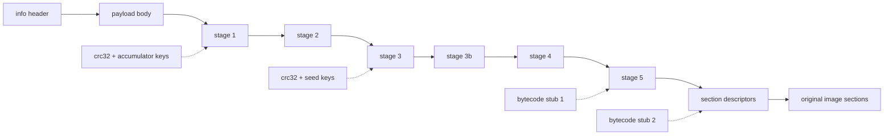

# 阶段链与标记布局

由[滚动 XOR 链](../../data-transforms/rolling-and-rotation.md#滚动密钥家族)解出的 payload 主体并不是程序——它是加载器自己的世界：配置表、加密的阶段代码，以及最终用来恢复程序节的描述符。加载器是**自解密的**：其代码被拆分为多个阶段，每个阶段都用在上一阶段正确解密后才存在的内容派生的密钥加密。控制权（或者静态分析）必须按序穿过各阶段；没有直达最终阶段表的捷径。



## 阶段解密的统一形式

stage 2 之后的每个阶段都用同一复合操作解密，由缓冲区内一个 `(src, src_len, dest, dest_len)` 四元组定义：

1. 用阶段 AES 调度表（`key_offsets[3]`）对 `src..src+src_len` 做 **AES-CBC 解密**。
2. 用阶段密钥对描述符做 [XOR + 循环右移](../../data-transforms/rolling-and-rotation.md#xor--循环右移-dword-密码)（移位 19）。
3. 若适用按构建定制的字节码 stub，则逐字节翻译。
4. 若 `src_len != dest_len`，用阶段 Huffman 表（`key_offsets[1]`）把 `src → dest` 做 **Huffman/LZ 解压**。

stage 3–5 不过是把这个复合操作应用到计算出的偏移处的四元组上，密钥来自校验和链。

## 64 位 EXE 流程（标记布局）

这是参考流程；其他家族都是它的变体。共分九个编号阶段。

### 阶段 1–2：头部与 payload

用 [KDF](../../file-structure/container-layout.md#info-头及其密钥派生) 派生 `info`，校验 magic，按 `SizeOfImage` 分配全零映像缓冲，对 `decrypt_size = info[6] - info[3] + 8192` 字节跑 [payload XOR 链](../../data-transforms/rolling-and-rotation.md#滚动密钥家族)，把剩余 `info[5] - decrypt_size` 字节原样拷入，再覆盖回前 4096 头字节。

### 阶段 3：配置锚点

配置块的位置随构建浮动，因此靠扫描定位：在 `[info[6] + 1000, info[6] + 8000)` 内找**锚点**——一个等于 `info[3]` 的 dword，其 `+8` 处的值略小于 `info[6]`（差值 ≤ `0x1000` 且为 `0x200` 的倍数）。随后是构建代际判别：配置版本戳在旧布局位于 `anchor + 104`、新布局位于 `anchor + 112`（其高半字节恒为 `0x4`），由此得 `anchor_extra ∈ {0, 8}`——自偏移 40 起的所有字段都按它平移。

从锚点：

* 导入目录 `(RVA, size)` 从 `anchor + 8` / `anchor + 4` 写回 PE 头。
* 遍历 `anchor + 184 (+extra)` 处的 `(offset, length)` 描述符表累积 `xor_acc`——各区域 `crc32 ^ length` 校验和的异或。
* **stage 1** 以 `xor_ror_dwords(anchor + 120 (+extra), xor_acc ^ chk1 ^ v, 21)` 解出，其中 `chk1` 是 `anchor + 56 (+extra)` 处描述符所指区域的校验和，`v` 是 `anchor + 20` 处的 dword。

### 阶段 4：stage 2

在 stage 1 内，stage-2 四元组是唯一满足 `d0 == d2`、`d0` 落在 payload 区间、`d1 > 0x10000` 且 `0 < d3 < d1` 的 16 字节项——记其偏移为 `stage2_off`。从它向前回溯，`chk_src_start` 是首个连续 4 个 `(src, len)` 都合理的位置。stage-2 密钥是 `chk_src_start - 20` 处的 dword，stage 2 以移位 19 解出。

在 stage 2 内，16 字节项 `(1, 0, info[3], 0)` 标记 `table_start`；**head** 表在 `table_start + 32`，**walk2** 在 `head - 88`。两个 head 条目按 kind dword 分派：kind `1`（或 `0x11`——高半字节是构建戳）对描述符跑 `byte_rotate3`；kind `2` 遍历 `(src, len, dst, chk)` 拷贝列表，把已解密区域搬到工作位置。walk2 条目随后给出四个**密钥偏移**（各经 `byte_rotate3` 解密）：

| 槽位               | 用途                  |
| ---------------- | ------------------- |
| `key_offsets[0]` | **节数据**块的 Huffman 表 |
| `key_offsets[1]` | **阶段**解压的 Huffman 表 |
| `key_offsets[2]` | **节数据**块的 AES 密钥调度  |
| `key_offsets[3]` | **阶段**解密的 AES 密钥调度  |

### 阶段 5：stage 3、3b、4、5

每个阶段的四元组位于 `stage2_off` 之后的固定偏移，每个密钥都混合运行中的 `xor_acc`、一个新校验和，以及从刚解密的前一阶段恢复的种子：

| 阶段       | 四元组偏移              | 密钥组成                                                                                                             |
| -------- | ------------------ | ---------------------------------------------------------------------------------------------------------------- |
| stage 3  | `stage2_off + 88`  | `xor_acc ^ chk2 ^ accum`——`accum` 取自 `chk_src_start - 16`，经四轮[三角数调度](../../data-transforms/checksums.md#三角数密钥调度) |
| stage 3b | `stage2_off + 104` | `xor_acc ^ chk3 ^ v4`——`v4` 是 stage 3 尾部最后一个非零 dword，以其前的 `C3 CC CC CC`（函数尾声 + `int3` 填充）锚定                      |
| stage 4  | `stage2_off + 136` | `xor_acc ^ chk4 ^ ~v5`——`v5` 是 stage 3b 中首个 `"Virtual..."` API 名字符串前 8 字节处的 dword                                |
| stage 5  | `stage2_off + 216` | `xor_acc ^ chk4 ^ chk5 ^ accum2`，外加字节码 stub 1                                                                    |

stage 4 是首个内嵌**字节码 stub** 出现的地方。它的邻居是反调试 API 名字符串（`IsDebuggerPresent`、`CheckRemoteDebuggerPresent`）；stub 本身靠[试 LFSR 解码并解析](../../data-transforms/bytecode-transform.md#按构建定制的字节码置换)定位，而非固定偏移。`accum2` 种子位于 `48 EB 01 B9` 字节模式最后一次出现（加上任意 `CC` 填充）之后，经三轮三角数推进。stage 5 是唯一经过字节码 stub 解密的阶段——stub 1 被烘进它的变换里。

### 阶段 6：stage-5 表

stage 5 持有恢复程序节的各张表。标记布局中，它们挂在两个字节标记上：

* `70 6D 00 00 63 6D 00 00`（`"pm\0\0cm\0\0"`）——即 `pm`/`cm` 子模块代码。
* `00 00 00 40 01 00 00 00`——“kind 标记”（dword 对 `0x40000000, 1`）。

相对 kind 标记：**walk4**（节加载描述符表指针）在 `−0x20`，**walk3**（校验链）在 `−0x18`，**walk5**（导入名指针表）在 `+8`。第二个**字节码 stub** 位于一个经发现得到的偏移（最旧构建为标记 `+960`；其余靠试解定位），**文件校验链**指针在它之前 `0x58` 字节处。

* **walk3** _只用于校验_：其 16 字节条目被临时解密、喂给对原始文件字节的链式 CRC-32，然后**复原为加密形态**——这条链存在的意义是检测篡改，而非产生输出。
* **文件校验链**被原地**永久**解密（16 字节 `byte_rotate2` 条目，直到长度为零）。
* stub 2 经 LFSR 解密并解析成 op 列表，应用于每个节块。

### 阶段 7：节恢复

walk4 表是位置串联的 16 字节描述符链——每个就地 `byte_rotate2` 解密——形如 `(src, len, dst, plain_len)`，以 `len` 为零终止。每块：

```
copy file[src + section_data_file_base .. +len] → image[dst]
aes_decrypt(dst, len, key_offsets[2])
translate dst..dst+len through bytecode stub 2
if len != plain_len: huffman_decompress(dst → dst, key_offsets[0], len, plain_len)
```

`section_data_file_base` 即[文件格式页](../../file-structure/companion-layout.md#在文件中定位节数据)给出的补码编码基址。随后第二条 walk4 链列出要清零的区域（`.bss` 等价物）。由于各块写入互不相交的映像区间、只读不可变的文件字节，这一阶段天然可并行——这是格式的性质，与任何工具无关。

### 阶段 8：导入名解密

walk5 条目（每个 20 字节）指向加密的 DLL 名（`+12`）与 thunk 链（`+0` 或 `+16`）。每个名字用[字符串密码](../../data-transforms/lfsr-strings-pages.md#导入名字符串密码)解密并转小写；每个按名 thunk（PE32+ 上 bit 63 清零）的 hint/name 字符串被解密、hint 字段清零。序数导入（bit 63 置位）原样保留。

### 阶段 9：PE 重建

最后阶段重建 PE 头——节表转换、加密的入口点/数据目录块、TLS 处理、`/FIXED` 策略、代码页扰动与托管元数据处理。这些是格式变换而非加载器阶段，见 [PE 变换](../pe-reconstruction/)。
