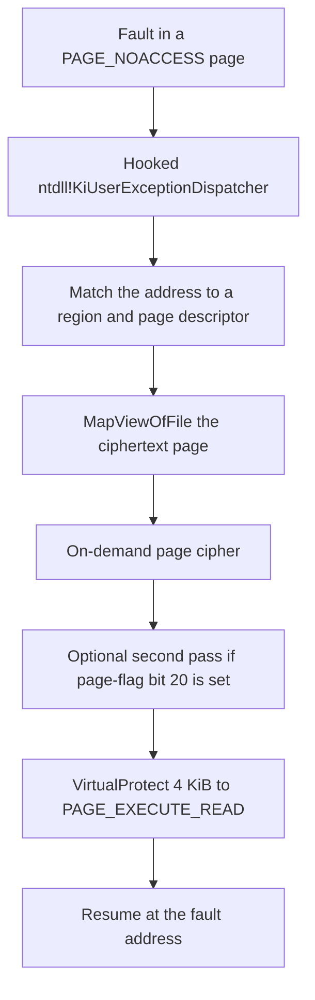

# 页保护与加载器代码

## 页级加密

最强的运行时层是可选的、按模块配置的。启用时（`640` 然后 `840`）：

1. 可执行节被批量解密（状态 `640`）。
2. 随后**逐页重新加密**，每页置为 `PAGE_NOACCESS`（状态 `840`）。
3. 执行到达受保护页时出错；异常处理器按需解密该页并恢复执行。

异常处理的安装方式是**补丁 `ntdll!KiUserExceptionDispatcher`**，使其跳入保护器的处理器，处理完再链回正常 SEH。内核把每个用户态异常都递交给这唯一入口点，因此该处理器先于一切 SEH 注册运行——并且对遍历 SEH 链寻找钩子的工具不可见。

对内存分析的一个推论：对页加密模块的朴素转储只能捕获自启动以来被触及的页（按需解密的工作集）；其余是密文或 `PAGE_NOACCESS` 填充。完整映像需要先强制每页缺页。某些构建还会**涂写**：已解密页驻留后，其选定字节被随机值 XOR 一次，因此原始转储需要反涂写。涂写是按构建的选项，并不总存在——有些页加密模块在每页都被触及后能干净转出。

页错误处理器不在受保护模块的映像内。它随一个手动映射的支持模块（`HtdpStub2.dll`——见 [Htsysm 内核组件](kernel-components.md)）分发，因此只转储主模块时找不到处理器签名。

## 按需页密码

一种已观察的处理器在缺页后走这条路径：



区域描述符表位于处理器模块内。处理器用基址和大小匹配故障地址。命中区域的页表是位于 `region_base + page_table_offset` 的 16 字节页描述符数组。页索引为 `(fault_address - region_base) >> 12`。

已观察的区域描述符字段：

| 偏移 | 大小 | 已观察用途 |
| --- | --- | --- |
| `+0x08` | 8 | 区域基址 |
| `+0x10` | 4 | 区域大小 |
| `+0x20` | 4 | 相对区域基址的页表偏移 |
| `+0x24` | 4 | 页数 |
| `+0x28` | 8 | 传给 `MapViewOfFile` 的映射句柄 |
| `+0x34` | 4 | 解密计数 |

已观察的页描述符字段（各 16 字节）：

| 偏移 | 大小 | 已观察用途 |
| --- | --- | --- |
| `+0x00` | 4 | 标志。第 20 位（`0x14`）选择第二次变换 |
| `+0x04` | 4 | 混入页密钥的材料 |
| `+0x08` | 4 | 最近一次 `GetTickCount` |
| `+0x0C` | 2 | 缺页次数 |
| `+0x0E` | 2 | 16 位字段；作用未确认 |

页密钥混合故障页地址、区域基址的低 32 位和逐页密钥材料。第一层变换是对 4 KiB 视图的 dword 密码：

```python
def demand_page_key(page_va, region_base, key_part):
    return ((page_va + region_base) ^ key_part) & MASK32


def demand_page_decrypt(buf, key):
    count = len(buf) >> 2
    state = ((key << 16) ^ key) & MASK32
    prev = state
    for i in range(count):
        enc = get_u32(buf, i * 4)
        state = rol32((state + i) & MASK32, 3)
        put_u32(buf, i * 4, enc ^ prev ^ state)
        prev = enc
```

`get_u32`、`put_u32`、`rol32` 和 `MASK32` 是[数据变换](../data-transforms/data-transforms.md)中的辅助函数。可运行副本在 [primitives.py](https://app.gitbook.com/s/L9bXLua8yrIPEUZOHO21/primitives.py)。

若页标志第 20 位被置位，同一 4 KiB 上再跑第二次变换。该函数尚未化成已发布的公式。处理器随后对这一页调用 `VirtualProtect(..., PAGE_EXECUTE_READ)` 并恢复执行。

该密码是按模块配置的选项，对应 `640` 再接 `840` 的序列，不是某一构建独有的附加层。

## 加载器自身的代码：多态与诱饵

加载器保卫其代码的力度不亚于其数据。在最终阶段（stage 5）及其自举代码中观察到的技术：

**多态发射。** 同一算法以许多置换副本出现——一个已观察映像携带同一密码序言的 16 个实例，仅在装饰性垃圾跳转的摆放上不同。反汇编器看到 16 个互不相干的函数；语义完全相同。

**反反汇编。** 无条件跳转后的垃圾字节、跳进多字节指令中间的跳转，以及返回地址算术（例如 `call $+5` 后随两个常量的加/减，其差恰是到真实续点的距离，被修改的返回地址随即被丢弃）。线性扫描乃至递归下降反汇编都会失步；一个 12.9 KB 的 stage-5 blob 几乎整体反编译为 “control flows out of bounds”。

**无操作诱饵 stub。** 自然的入口点是消耗分析者耐心的陷阱，而非真实代码。一个 stub 保存全部 16 个 GPR，执行 VMware 后门探测，比较结果，然后执行位移为 0 的 `jne $+2`——两个分支到达同一条指令——恢复每个寄存器并返回。它唯一的副作用是 `in` 指令的**计时**，在别处被消费。另一个诱饵把载荷藏在陷阱标志后：`pushfq; or [rsp], 0x100; popfq` 触发 `#DB`；正常执行下 SEH 重定向跳过其后的代码，只有当调试器（或朴素模拟器）吞下异常并继续时，“隐藏”路径才会运行——而那是一条没有用的路。

**自修改元数据。** 阶段表用后即清零：预载映像中存在的标记在模块完成初始化时已被覆写，因此启动后的转储会缺静态文件中存在的结构。

## 从磁盘自我加载

最终阶段不做反射式内存加载。其 API 字符串表包含 `GetModuleFileNameW/A`、`CreateFileW`、`CreateFileMappingA`、`MapViewOfFile`、`UnmapViewOfFile`、`GetFileSize`、`GetFullPathNameW/A`、`CloseHandle`、`RtlGetVersion`、`SystemTimeToFileTime`、`Sleep`——文件 I/O 与模块路径 API，没有任何分配、保护或加载器 API。该阶段解析自身的磁盘路径，把受保护文件映射为内存视图，并从该视图读取加密 payload。（这也是静态分析能把同样的算法喂以原始文件字节、离线重放的原因。）

运行时状态保存在一个由保留寄存器寻址的上下文结构中：固定槽位的函数指针、指向映像缓冲区的双重间接指针，以及由展开的 `lea`-加-store 序列构建的逐槽表。API 地址从模块自身经 OS 解析的导入表读出——整个阶段中没有任何 PEB 遍历，因此该模块依赖普通 Windows 加载器已绑定其导入，尽管它存储的 `AddressOfEntryPoint` 是垃圾、OS 从不调用其真实入口。

同一阶段内含自己的 `.reloc` 遍历器：重定位由加载器施加（状态 `655`），而非 OS——与 [PE 变换](../loading-and-pe-repair/pe-reconstruction/)中的 `/FIXED` 处理一致。
