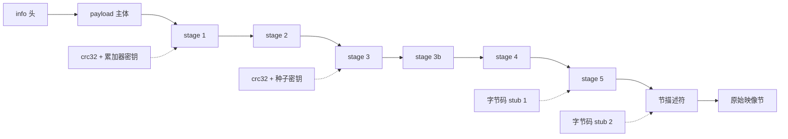

# 分阶段加载器

由[滚动 XOR 链](primitives.md#滚动密钥家族)解出的 payload 主体并不是程序——它是加载器自己的世界：配置表、加密的阶段代码，以及最终用来恢复程序节的描述符。加载器是**自解密的**：其代码被拆分为多个阶段，每个阶段都用在上一阶段正确解密后才存在的内容派生的密钥加密。控制权（或者静态分析）必须按序穿过各阶段；没有直达最终阶段表的捷径。



## 阶段解密的统一形式

stage 2 之后的每个阶段都用同一复合操作解密，由缓冲区内一个 `(src, src_len, dest, dest_len)` 四元组定义：

1. 用阶段 AES 调度表（`key_offsets[3]`）对 `src..src+src_len` 做 **AES-CBC 解密**。
2. 用阶段密钥对描述符做 [XOR + 循环右移](primitives.md#xor--循环右移-dword-密码)（移位 19）。
3. 若适用按构建定制的字节码 stub，则逐字节翻译。
4. 若 `src_len != dest_len`，用阶段 Huffman 表（`key_offsets[1]`）把 `src → dest` 做 **Huffman/LZ 解压**。

stage 3–5 不过是把这个复合操作应用到计算出的偏移处的四元组上，密钥来自校验和链。

## 64 位 EXE 流程（标记布局）

这是参考流程；其他家族都是它的变体。共分九个编号阶段。

### 阶段 1–2：头部与 payload

用 [KDF](file-format.md#info-头及其密钥派生) 派生 `info`，校验 magic，按 `SizeOfImage` 分配全零映像缓冲，对 `decrypt_size = info[6] - info[3] + 8192` 字节跑 [payload XOR 链](primitives.md#滚动密钥家族)，把剩余 `info[5] - decrypt_size` 字节原样拷入，再覆盖回前 4096 头字节。

### 阶段 3：配置锚点

配置块的位置随构建浮动，因此靠扫描定位：在 `[info[6] + 1000, info[6] + 8000)` 内找**锚点**——一个等于 `info[3]` 的 dword，其 `+8` 处的值略小于 `info[6]`（差值 ≤ `0x1000` 且为 `0x200` 的倍数）。随后是构建代际判别：配置版本戳在旧布局位于 `anchor + 104`、新布局位于 `anchor + 112`（其高半字节恒为 `0x4`），由此得 `anchor_extra ∈ {0, 8}`——自偏移 40 起的所有字段都按它平移。

从锚点：

- 导入目录 `(RVA, size)` 从 `anchor + 8` / `anchor + 4` 写回 PE 头。
- 遍历 `anchor + 184 (+extra)` 处的 `(offset, length)` 描述符表累积 `xor_acc`——各区域 `crc32 ^ length` 校验和的异或。
- **stage 1** 以 `xor_ror_dwords(anchor + 120 (+extra), xor_acc ^ chk1 ^ v, 21)` 解出，其中 `chk1` 是 `anchor + 56 (+extra)` 处描述符所指区域的校验和，`v` 是 `anchor + 20` 处的 dword。

### 阶段 4：stage 2

在 stage 1 内，stage-2 四元组是唯一满足 `d0 == d2`、`d0` 落在 payload 区间、`d1 > 0x10000` 且 `0 < d3 < d1` 的 16 字节项——记其偏移为 `stage2_off`。从它向前回溯，`chk_src_start` 是首个连续 4 个 `(src, len)` 都合理的位置。stage-2 密钥是 `chk_src_start - 20` 处的 dword，stage 2 以移位 19 解出。

在 stage 2 内，16 字节项 `(1, 0, info[3], 0)` 标记 `table_start`；**head** 表在 `table_start + 32`，**walk2** 在 `head - 88`。两个 head 条目按 kind dword 分派：kind `1`（或 `0x11`——高半字节是构建戳）对描述符跑 `byte_rotate3`；kind `2` 遍历 `(src, len, dst, chk)` 拷贝列表，把已解密区域搬到工作位置。walk2 条目随后给出四个**密钥偏移**（各经 `byte_rotate3` 解密）：

| 槽位 | 用途 |
| --- | --- |
| `key_offsets[0]` | **节数据**块的 Huffman 表 |
| `key_offsets[1]` | **阶段**解压的 Huffman 表 |
| `key_offsets[2]` | **节数据**块的 AES 密钥调度 |
| `key_offsets[3]` | **阶段**解密的 AES 密钥调度 |

### 阶段 5：stage 3、3b、4、5

每个阶段的四元组位于 `stage2_off` 之后的固定偏移，每个密钥都混合运行中的 `xor_acc`、一个新校验和，以及从刚解密的前一阶段恢复的种子：

| 阶段 | 四元组偏移 | 密钥组成 |
| --- | --- | --- |
| stage 3 | `stage2_off + 88` | `xor_acc ^ chk2 ^ accum`——`accum` 取自 `chk_src_start - 16`，经四轮[三角数调度](primitives.md#三角数密钥调度) |
| stage 3b | `stage2_off + 104` | `xor_acc ^ chk3 ^ v4`——`v4` 是 stage 3 尾部最后一个非零 dword，以其前的 `C3 CC CC CC`（函数尾声 + `int3` 填充）锚定 |
| stage 4 | `stage2_off + 136` | `xor_acc ^ chk4 ^ ~v5`——`v5` 是 stage 3b 中首个 `"Virtual..."` API 名字符串前 8 字节处的 dword |
| stage 5 | `stage2_off + 216` | `xor_acc ^ chk4 ^ chk5 ^ accum2`，外加字节码 stub 1 |

stage 4 是首个内嵌**字节码 stub** 出现的地方。它的邻居是反调试 API 名字符串（`IsDebuggerPresent`、`CheckRemoteDebuggerPresent`）；stub 本身靠[试 LFSR 解码并解析](primitives.md#按构建定制的字节码置换)定位，而非固定偏移。`accum2` 种子位于 `48 EB 01 B9` 字节模式最后一次出现（加上任意 `CC` 填充）之后，经三轮三角数推进。stage 5 是唯一经过字节码 stub 解密的阶段——stub 1 被烘进它的变换里。

### 阶段 6：stage-5 表

stage 5 持有恢复程序节的各张表。标记布局中，它们挂在两个字节标记上：

- `70 6D 00 00 63 6D 00 00`（`"pm\0\0cm\0\0"`）——即 `pm`/`cm` 子模块代码。
- `00 00 00 40 01 00 00 00`——“kind 标记”（dword 对 `0x40000000, 1`）。

相对 kind 标记：**walk4**（节加载描述符表指针）在 `−0x20`，**walk3**（校验链）在 `−0x18`，**walk5**（导入名指针表）在 `+8`。第二个**字节码 stub** 位于一个经发现得到的偏移（最旧构建为标记 `+960`；其余靠试解定位），**文件校验链**指针在它之前 `0x58` 字节处。

- **walk3** *只用于校验*：其 16 字节条目被临时解密、喂给对原始文件字节的链式 CRC-32，然后**复原为加密形态**——这条链存在的意义是检测篡改，而非产生输出。
- **文件校验链**被原地**永久**解密（16 字节 `byte_rotate2` 条目，直到长度为零）。
- stub 2 经 LFSR 解密并解析成 op 列表，应用于每个节块。

### 阶段 7：节恢复

walk4 表是位置串联的 16 字节描述符链——每个就地 `byte_rotate2` 解密——形如 `(src, len, dst, plain_len)`，以 `len` 为零终止。每块：

```
拷贝 file[src + section_data_file_base .. +len] → image[dst]
aes_decrypt(dst, len, key_offsets[2])
用字节码 stub 2 翻译 dst..dst+len
若 len != plain_len：huffman_decompress(dst → dst, key_offsets[0], len, plain_len)
```

`section_data_file_base` 即[文件格式页](file-format.md#在文件中定位节数据)给出的补码编码基址。随后第二条 walk4 链列出要清零的区域（`.bss` 等价物）。由于各块写入互不相交的映像区间、只读不可变的文件字节，这一阶段天然可并行——这是格式的性质，与任何工具无关。

### 阶段 8：导入名解密

walk5 条目（每个 20 字节）指向加密的 DLL 名（`+12`）与 thunk 链（`+0` 或 `+16`）。每个名字用[字符串密码](primitives.md#导入名字符串密码)解密并转小写；每个按名 thunk（PE32+ 上 bit 63 清零）的 hint/name 字符串被解密、hint 字段清零。序数导入（bit 63 置位）原样保留。

### 阶段 9：PE 重建

最后阶段重建 PE 头——节表转换、加密的入口点/数据目录块、TLS 处理、`/FIXED` 策略、代码页扰动与托管元数据处理。这些是格式变换而非加载器阶段，见 [PE 变换](pe-transformations.md)。

## 32 位（PE32）流程

32 位家族共享头部/payload 阶段，随后完全分叉：不同的锚点、额外一代阶段，以及在 64 位流程取固定值处使用爆破参数。

**`tbl` 锚点。** 在 `info[6]` 附近的 shell 区扫描一个等于 `info[6]`、后随合理 shell 大小的 dword；锚点在其前 `0x88` 字节。导入/资源目录从 `tbl + 0xBC/0xC8/0xCC` 恢复；**头部校验和**——对 `tbl + 0x58` 处描述符链逐项 `calculate_checksum` 的异或——成为之后每个阶段密钥的组成部分。注意其含义：阶段密钥依赖*原始加壳前 PE 头*的校验和。

**SecondStage。** `tbl + 0x98` 处的 `(offset, size)` 对以 `ss_key = header_checksum ^ first_stage_cs ^ second_stage_key`（移位 21）解出。常量 `ss_shift = ss_size − 0xBC0` 随后参数化*每一个*后续偏移——一种对整个阶段布局的按构建置换。原生 DLL 带有加壳器添加的 BaseReloc 数据目录（原始头部没有），因此头部校验和只有把该项清零后才匹配；两种变体都试，ThirdStage 指针通过校验者胜出。

**ThirdStage。** 移位量未被记录；在 `[19, 21, 17, 23, 15, 25, 13, 11]` 上爆破，接受输出中含 info 表签名（一个 `1`/`0x11` 项后随 `2` 项且地址合理）的移位量。四个密钥偏移位于 info 表前 `0x58` 字节，解密方式同 64 位流程。

**Fourth/Fifth/Seventh。** 分别从 `dp_base + 0x40/0x50/0x70` 处的四元组解出，密钥形如 `header_checksum ^ crc32(前一区域) ^ advance_key(种子)`，种子取自刚解密的前一阶段。Seventh 阶段内含首个**字节码 stub**（先向后、失败再向前地 LFSR 扫描定位）。

**EighthStage 及其密钥搜索。** Eighth 阶段密钥同样不被存储：候选项从 stub 周围的间隙启发式收集（区域末端间隙 `0xD0…0x100`、stub 相对间隙，以及对非可打印 dword 的线性扫描），各经 `advance_key(raw, 3)` 后逐个代入完整的阶段解密复合操作。胜者是结果**能干净解压且指针落在映像内**的候选——Huffman 解码器的成功/失败信号在此用作判定器。

**配置簇。** Eighth 阶段持有最终的表簇，相对一基址取固定偏移：导入表 `+0x18`、文件校验链 `+0x30`、节描述符 `+0x40`、清零列表 `+0x48`、文件数据**字节码 stub** 在 `+0x4B4`。经典构建在该基址戳有 dword `0x00007679`（一个同时出现在驱动名中的构建版本值——见[内核驱动与子模块](kernel-components.md)）；无戳构建则按校验链槽位的形状定位（指针恰在 `info[3]` 之后、带一个小的 16 对齐尺寸）。

**文件解密器，需证明。** 文件数据字节码 stub 不信任最近的扫描命中：每个候选都通过在快照上重放首个*压缩*块的完整变换（拷贝 → AES → 翻译 → 解压）并要求解压成功来验证。真实构建中确实存在能解码出错误翻译表的巧合 LFSR 形块——在一个已观察的 32 位家族中，它就位于真 stub 之前几十字节——因此试解-验证是唯一安全的选择。

**输出。** 32 位流程以节表修补、代码页扰动（公式由 `0xCC` 统计选出）、导入重建（EXE 附带 `.kmiat` 搬迁）、TLS 重建，以及把 RVA 布局映像压实回文件对齐 PE 的收尾压缩结束。详见 [PE 变换](pe-transformations.md)。

## 专用 DLL 布局（较旧 DLL）

较旧的受保护 DLL 布局运行同一套原语，但把配置块钉在**固定锚点** `keys[6] + 5592`——无需扫描。所有字段都是它的固定偏移：

| 锚点偏移 | 内容 |
| --- | --- |
| `+4` / `+8` | 导入目录 Size / RVA |
| `+20` | 主描述符加密密钥 |
| `+40` / `+44` | 资源目录 RVA / Size |
| `+48` / `+56` | 校验和描述符（checksum2 / checksum1） |
| `+120` | 主描述符 → 主阶段表 |
| `+184` | XOR 累加校验链 |

阶段链随后运行：主表（移位 21）→ `+3632` 处的次级表（移位 19，密钥为 `+3444` 处的 dword）→ `+9248` 处的两个重定位块（kind `1`/`0x11`：对描述符就地跑 rotate-by-3 密码；kind `2`：一个 `(src, size, dst, verify)` 拷贝遍历，其 16 字节条目以 rotate-by-2 密码解密）→ `+9160` 处的四个解压参数 → `+3712/+3728/+3760/+3840` 处的代码块 1–4，各自带校验和链密钥（含四轮与三轮三角数累加）→ 两个字节码 stub（`addr4 + 3200` 与 `metadata + 88`）→ `addr5 + 11976` 处的节描述符遍历。

两个该家族独有的细节：

- 节描述符存储 `(dest, size, src, expected_crc)`；磁盘基址为 `section_image_base = 4095 − u32@0x1080`，仅当 `size != expected_crc` 时解压。（该字段被复用为解压后尺寸，并非 CRC。）
- PE 头元数据以 `keys[3] + 16` 处一个 656 字节 blob 交付，用位置密钥的 rotate-by-2 密码（与 [byte_rotate2](primitives.md#三重字节旋转密码) 同一构造）解密：入口点在 blob 内 `0x10` 处，完整的 128 字节数据目录数组在 `0x20` 处；二者都被写入 PE 头（`pe + 40` 与 `pe + 136`）。

此家族中的托管 DLL 还会在节恢复之前，从原文件预填含 CLR 头的节，并在之后重拷 COR20 区域——CLR 结构是被保留而非加密的。

## 无标记布局（较新 64 位构建）

较新构建去掉了两个 stage-5 标记，walk3/walk4/walk5 槽位因此无法由标记推出。布局改为结构化发现：

1. **收集最终阶段内全部 LFSR 包裹的字节码块**（逐个试解码并解析候选，每次命中后逐字节前进——假阳性可能紧贴真 stub 之前，固定步长跳过会越过真身）。
2. **选文件解密器**：取校验链指针（`块 − 0x58`）落在 `info[3]` 之后、正距离最小者。
3. **找节描述符表**：扫描 stub 附近的指针槽，用 `trial_byte_rotate2` 试解其目标，直到某个解析为合理的 `(src, src_len, dst, dest_len)` 描述符。
4. **证明选择**：在所选 stub 下重放首个压缩块的完整变换，要求解压成功。

与标记布局的其他差异：只用于校验的 walk3 链不存在；导入从 PE 导入目录而非 walk5 指针表重建；入口点/数据目录块使用 “Layout B” 摆放；代码页扰动推迟到托管元数据恢复*之后*（见 [PE 变换](pe-transformations.md)）。这些构建还保留其重定位表与 ASLR 标志——它们不是 `/FIXED`。

## 为什么一切都要扫描，以及如何避免选错

一个反复出现的设计事实：容器里几乎没有任何东西跨构建固定在某一偏移。加壳器置换表的摆放（32 位甚至以 `ss_shift` 参数化），在较新世代省略标记，并投放诱饵形数据——巧合的合法字节码块、貌似合理的指针。加载器自身从不搜索（它知道自己的布局）；任何静态读者都必须搜索。

可靠的模式是**试解-验证，绝不信任首个命中**：

- 结构判定器：等于 `info[3]` 的锚点 dword、`(1, 0, info[3], 0)` 表签名、描述符形状检查。
- 内容判定器：配置版本戳的高半字节、`C3 CC CC CC` 尾声锚点、API 名字符串。
- 密码学判定器：只有解密正确才匹配的校验和字段，以及 Huffman 解码器的干净/失败信号——最强的判定器，因为错误密钥实质上不可能产生恰好解压到预期尺寸的流。

被判定器拦下的错误选择会落到下一个候选；而*没有*判定器的错误选择会产生隐性损坏的映像，这比报错更糟。上述流程中的每个选择点都至少有一个判定器——在对此格式的任何分析中，这都是值得保持的性质。
