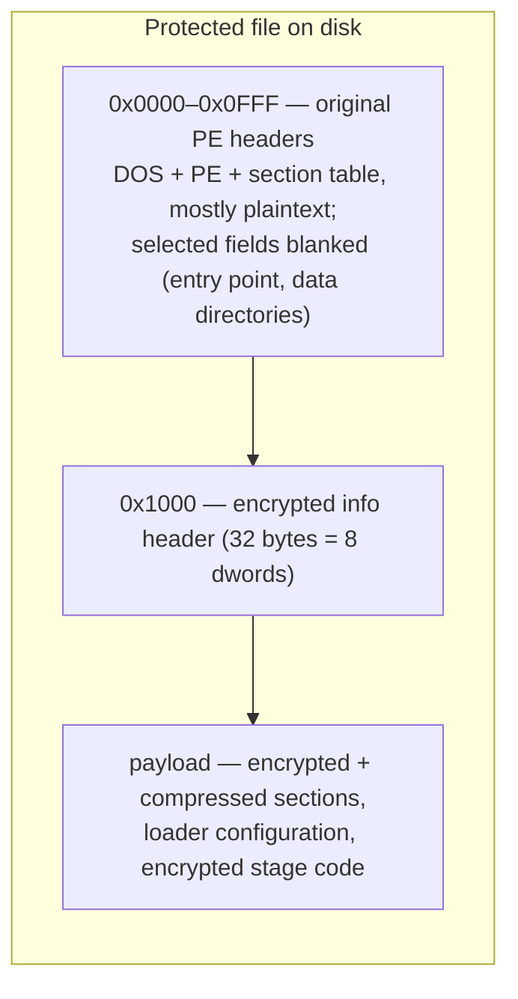

# 容器與加密頭

受保護文件是一個原始映像已被加密容器替換的 PE 文件。容器在文件前部保留原始 PE 頭（基本可讀），在固定偏移處以密鑰派生函數隱藏一個小參數塊，其餘一切——程序的節與加載器自身的代碼——都以加密且通常壓縮的 payload 形式存儲。

## 容器佈局



有三個區域需要關注：

| 區域      | 文件偏移              | 內容                                                                |
| ------- | ----------------- | ----------------------------------------------------------------- |
| 頭區      | `0x0000`–`0x0FFF` | 原始 PE 頭。DOS/PE 簽名、COFF 頭、可選頭與節表以明文倖存，但入口點、若干數據目錄與節原始數據指針被抹除或改作他用。 |
| info 頭  | `0x1000`          | 32 字節：八個 dword，以下面的密鑰派生函數加密。這是整個容器的主參數塊。                          |
| payload | `0x1020` 起        | 原始映像被加密（並經 Huffman 壓縮）的節數據、加載器配置表，以及加載器自身的分階段代碼。                  |

恰好在 4096 字節（`0x1000`）處的分界在所有已觀察構建中恆定——包括本頁末尾描述的外置伴生體佈局，它正是在這個精確邊界上拆分文件的。

## info 頭及其密鑰派生

偏移 `0x1000` 處的八個 dword 用一個滾動密鑰 KDF 解密。`info[0]` 直接存儲；後續每個單元都與一個滾動密鑰異或，該密鑰混入單元值與索引平方向前滾動：

```python
def header_kdf(file_data, offset=4096):
    info = [0] * 8
    info[0] = get_u32(file_data, offset)
    k = info[0]
    for i in range(7):
        cell = get_u32(file_data, offset + 4 + 4 * i)
        info[i + 1] = k ^ cell
        k = (i * i) ^ ((k + cell - i) & 0xFFFFFFFF)
    return info
```

同一 KDF 適用於所有構建家族——EXE 與 DLL、32 位與 64 位——因此一條代碼路徑即可識別所有受保護文件。解密後的字段驅動整個解包過程：

| 字段        | 含義                                         |
| --------- | ------------------------------------------ |
| `info[0]` | 種子密鑰（明文存儲；同時餵給 payload 密碼）                 |
| `info[1]` | **格式 magic**——標識保護構建（見下文）                  |
| `info[2]` | 保留/變體                                      |
| `info[3]` | 重建映像中放置 payload 的基址 RVA                    |
| `info[4]` | payload 源偏移：payload 起於文件內 `info[4] + 4096` |
| `info[5]` | payload 總大小（拷入映像 `info[3]` 處的字節數）          |
| `info[6]` | 解密區結束標記；加載器配置塊相對它定位                        |
| `info[7]` | 保留/變體                                      |

因此 payload 的搬運為：文件區間 `[info[4] + 4096, info[4] + 4096 + info[5])` → 映像區間 `[info[3], info[3] + info[5])`。前 `decrypt_size = info[6] - info[3] + 8192` 字節以滾動 XOR 鏈解密（見[數據變換原語](../data-transforms/data-transforms.md)）；其餘原樣拷貝。隨後文件前 4096 字節被覆蓋回映像作為其頭部。

### 格式 magic

`info[1]` 是構建的戳記，即格式 magic：

| magic（LE 字節） | 值            |
| ------------ | ------------ |
| `KONN`       | `0x4E4E4F4B` |
