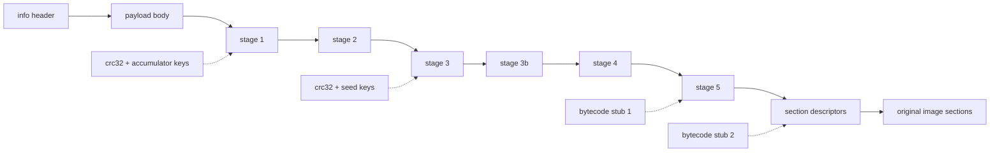

# 階段鏈與標記佈局

由[滾動 XOR 鏈](../../data-transforms/rolling-and-rotation.md#滾動密鑰家族)解出的 payload 主體並不是程序——它是加載器自己的世界：配置表、加密的階段代碼，以及最終用來恢復程序節的描述符。加載器是**自解密的**：其代碼被拆分為多個階段，每個階段都用在上一階段正確解密後才存在的內容派生的密鑰加密。控制權（或者靜態分析）必須按序穿過各階段；沒有直達最終階段表的捷徑。



## 階段解密的統一形式

stage 2 之後的每個階段都用同一複合操作解密，由緩衝區內一個 `(src, src_len, dest, dest_len)` 四元組定義：

1. 用階段 AES 調度表（`key_offsets[3]`）對 `src..src+src_len` 做 **AES-CBC 解密**。
2. 用階段密鑰對描述符做 [XOR + 循環右移](../../data-transforms/rolling-and-rotation.md#xor--循環右移-dword-密碼)（移位 19）。
3. 若適用按構建定製的字節碼 stub，則逐字節翻譯。
4. 若 `src_len != dest_len`，用階段 Huffman 表（`key_offsets[1]`）把 `src → dest` 做 **Huffman/LZ 解壓**。

stage 3–5 不過是把這個複合操作應用到計算出的偏移處的四元組上，密鑰來自校驗和鏈。

## 64 位 EXE 流程（標記佈局）

這是參考流程；其他家族都是它的變體。共分九個編號階段。

### 階段 1–2：頭部與 payload

用 [KDF](../../file-structure/container-layout.md#info-頭及其密鑰派生) 派生 `info`，校驗 magic，按 `SizeOfImage` 分配全零映像緩衝，對 `decrypt_size = info[6] - info[3] + 8192` 字節跑 [payload XOR 鏈](../../data-transforms/rolling-and-rotation.md#滾動密鑰家族)，把剩餘 `info[5] - decrypt_size` 字節原樣拷入，再覆蓋回前 4096 頭字節。

### 階段 3：配置錨點

配置塊的位置隨構建浮動，因此靠掃描定位：在 `[info[6] + 1000, info[6] + 8000)` 內找**錨點**——一個等於 `info[3]` 的 dword，其 `+8` 處的值略小於 `info[6]`（差值 ≤ `0x1000` 且為 `0x200` 的倍數）。隨後是構建代際判別：配置版本戳在舊佈局位於 `anchor + 104`、新佈局位於 `anchor + 112`（其高半字節恆為 `0x4`），由此得 `anchor_extra ∈ {0, 8}`——自偏移 40 起的所有字段都按它平移。

從錨點：

* 導入目錄 `(RVA, size)` 從 `anchor + 8` / `anchor + 4` 寫回 PE 頭。
* 遍歷 `anchor + 184 (+extra)` 處的 `(offset, length)` 描述符表累積 `xor_acc`——各區域 `crc32 ^ length` 校驗和的異或。
* **stage 1** 以 `xor_ror_dwords(anchor + 120 (+extra), xor_acc ^ chk1 ^ v, 21)` 解出，其中 `chk1` 是 `anchor + 56 (+extra)` 處描述符所指區域的校驗和，`v` 是 `anchor + 20` 處的 dword。

### 階段 4：stage 2

在 stage 1 內，stage-2 四元組是唯一滿足 `d0 == d2`、`d0` 落在 payload 區間、`d1 > 0x10000` 且 `0 < d3 < d1` 的 16 字節項——記其偏移為 `stage2_off`。從它向前回溯，`chk_src_start` 是首個連續 4 個 `(src, len)` 都合理的位置。stage-2 密鑰是 `chk_src_start - 20` 處的 dword，stage 2 以移位 19 解出。

在 stage 2 內，16 字節項 `(1, 0, info[3], 0)` 標記 `table_start`；**head** 表在 `table_start + 32`，**walk2** 在 `head - 88`。兩個 head 條目按 kind dword 分派：kind `1`（或 `0x11`——高半字節是構建戳）對描述符跑 `byte_rotate3`；kind `2` 遍歷 `(src, len, dst, chk)` 拷貝列表，把已解密區域搬到工作位置。walk2 條目隨後給出四個**密鑰偏移**（各經 `byte_rotate3` 解密）：

| 槽位               | 用途                  |
| ---------------- | ------------------- |
| `key_offsets[0]` | **節數據**塊的 Huffman 表 |
| `key_offsets[1]` | **階段**解壓的 Huffman 表 |
| `key_offsets[2]` | **節數據**塊的 AES 密鑰調度  |
| `key_offsets[3]` | **階段**解密的 AES 密鑰調度  |

### 階段 5：stage 3、3b、4、5

每個階段的四元組位於 `stage2_off` 之後的固定偏移，每個密鑰都混合運行中的 `xor_acc`、一個新校驗和，以及從剛解密的前一階段恢復的種子：

| 階段       | 四元組偏移              | 密鑰組成                                                                                                             |
| -------- | ------------------ | ---------------------------------------------------------------------------------------------------------------- |
| stage 3  | `stage2_off + 88`  | `xor_acc ^ chk2 ^ accum`——`accum` 取自 `chk_src_start - 16`，經四輪[三角數調度](../../data-transforms/checksums.md#三角數密鑰調度) |
| stage 3b | `stage2_off + 104` | `xor_acc ^ chk3 ^ v4`——`v4` 是 stage 3 尾部最後一個非零 dword，以其前的 `C3 CC CC CC`（函數尾聲 + `int3` 填充）錨定                      |
| stage 4  | `stage2_off + 136` | `xor_acc ^ chk4 ^ ~v5`——`v5` 是 stage 3b 中首個 `"Virtual..."` API 名字符串前 8 字節處的 dword                                |
| stage 5  | `stage2_off + 216` | `xor_acc ^ chk4 ^ chk5 ^ accum2`，外加字節碼 stub 1                                                                    |

stage 4 是首個內嵌**字節碼 stub** 出現的地方。它的鄰居是反調試 API 名字符串（`IsDebuggerPresent`、`CheckRemoteDebuggerPresent`）；stub 本身靠[試 LFSR 解碼並解析](../../data-transforms/bytecode-transform.md#按構建定製的字節碼置換)定位，而非固定偏移。`accum2` 種子位於 `48 EB 01 B9` 字節模式最後一次出現（加上任意 `CC` 填充）之後，經三輪三角數推進。stage 5 是唯一經過字節碼 stub 解密的階段——stub 1 被烘進它的變換裡。

### 階段 6：stage-5 表

stage 5 持有恢復程序節的各張表。標記佈局中，它們掛在兩個字節標記上：

* `70 6D 00 00 63 6D 00 00`（`"pm\0\0cm\0\0"`）——即 `pm`/`cm` 子模塊代碼。
* `00 00 00 40 01 00 00 00`——“kind 標記”（dword 對 `0x40000000, 1`）。

相對 kind 標記：**walk4**（節加載描述符表指針）在 `−0x20`，**walk3**（校驗鏈）在 `−0x18`，**walk5**（導入名指針表）在 `+8`。第二個**字節碼 stub** 位於一個經發現得到的偏移（最舊構建為標記 `+960`；其餘靠試解定位），**文件校驗鏈**指針在它之前 `0x58` 字節處。

* **walk3** *只用於校驗*：其 16 字節條目被臨時解密、餵給對原始文件字節的鏈式 CRC-32，然後**復原為加密形態**——這條鏈存在的意義是檢測篡改，而非產生輸出。
* **文件校驗鏈**被原地**永久**解密（16 字節 `byte_rotate2` 條目，直到長度為零）。
* stub 2 經 LFSR 解密並解析成 op 列表，應用於每個節塊。

### 階段 7：節恢復

walk4 表是位置串聯的 16 字節描述符鏈——每個就地 `byte_rotate2` 解密——形如 `(src, len, dst, plain_len)`，以 `len` 為零終止。每塊：

```
copy file[src + section_data_file_base .. +len] → image[dst]
aes_decrypt(dst, len, key_offsets[2])
translate dst..dst+len through bytecode stub 2
if len != plain_len: huffman_decompress(dst → dst, key_offsets[0], len, plain_len)
```

`section_data_file_base` 即[文件格式頁](../../file-structure/companion-layout.md#在文件中定位節數據)給出的補碼編碼基址。隨後第二條 walk4 鏈列出要清零的區域（`.bss` 等價物）。由於各塊寫入互不相交的映像區間、只讀不可變的文件字節，這一階段天然可並行——這是格式的性質，與任何工具無關。

### 階段 8：導入名解密

walk5 條目（每個 20 字節）指向加密的 DLL 名（`+12`）與 thunk 鏈（`+0` 或 `+16`）。每個名字用[字符串密碼](../../data-transforms/lfsr-strings-pages.md#導入名字符串密碼)解密並轉小寫；每個按名 thunk（PE32+ 上 bit 63 清零）的 hint/name 字符串被解密、hint 字段清零。序數導入（bit 63 置位）原樣保留。walk5 指針為 null 表示沒有表可走：託管程序集把該槽留空，因為它們的導入只是 CLR 引導 stub。

### 階段 9：PE 重建

最後階段重建 PE 頭——節錶轉換、加密的入口點/數據目錄塊、TLS 處理、`/FIXED` 策略、代碼頁擾動與託管元數據處理。這些是格式變換而非加載器階段，見 [PE 變換](../pe-reconstruction/)。
