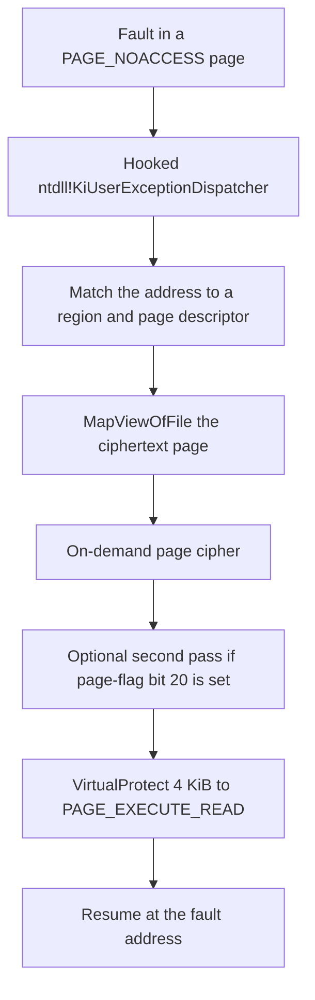

# 頁保護與加載器代碼

## 頁級加密

最強的運行時層是可選的、按模塊配置的。啟用時（`640` 然後 `840`）：

1. 可執行節被批量解密（狀態 `640`）。
2. 隨後**逐頁重新加密**，每頁置為 `PAGE_NOACCESS`（狀態 `840`）。
3. 執行到達受保護頁時出錯；異常處理器按需解密該頁並恢復執行。

異常處理的安裝方式是**補丁 `ntdll!KiUserExceptionDispatcher`**，使其跳入保護器的處理器，處理完再鏈回正常 SEH。內核把每個用戶態異常都遞交給這唯一入口點，因此該處理器先於一切 SEH 註冊運行——並且對遍歷 SEH 鏈尋找鉤子的工具不可見。

對內存分析的一個推論：對頁加密模塊的樸素轉儲只能捕獲自啟動以來被觸及的頁（按需解密的工作集）；其餘是密文或 `PAGE_NOACCESS` 填充。完整映像需要先強制每頁缺頁。某些構建還會**塗寫**：已解密頁駐留後，其選定字節被隨機值 XOR 一次，因此原始轉儲需要反塗寫。塗寫是按構建的選項，並不總存在——有些頁加密模塊在每頁都被觸及後能乾淨轉出。

頁錯誤處理器不在受保護模塊的映像內。它隨一個手動映射的支持模塊（`HtdpStub2.dll`——見 [Htsysm 內核組件](kernel-components.md)）分發，因此只轉儲主模塊時找不到處理器簽名。

## 按需頁密碼

一種已觀察的處理器在缺頁後走這條路徑：



區域描述符表位於處理器模塊內。處理器用基址和大小匹配故障地址。命中區域的頁表是位於 `region_base + page_table_offset` 的 16 字節頁描述符數組。頁索引為 `(fault_address - region_base) >> 12`。

已觀察的區域描述符字段：

| 偏移 | 大小 | 已觀察用途 |
| --- | --- | --- |
| `+0x08` | 8 | 區域基址 |
| `+0x10` | 4 | 區域大小 |
| `+0x20` | 4 | 相對區域基址的頁表偏移 |
| `+0x24` | 4 | 頁數 |
| `+0x28` | 8 | 傳給 `MapViewOfFile` 的映射句柄 |
| `+0x34` | 4 | 解密計數 |

已觀察的頁描述符字段（各 16 字節）：

| 偏移 | 大小 | 已觀察用途 |
| --- | --- | --- |
| `+0x00` | 4 | 標誌。第 20 位（`0x14`）選擇第二次變換 |
| `+0x04` | 4 | 混入頁密鑰的材料 |
| `+0x08` | 4 | 最近一次 `GetTickCount` |
| `+0x0C` | 2 | 缺頁次數 |
| `+0x0E` | 2 | 16 位字段；作用未確認 |

頁密鑰混合故障頁地址、區域基址的低 32 位和逐頁密鑰材料。第一層變換是對 4 KiB 視圖的 dword 密碼：

```python
def demand_page_key(page_va, region_base, key_part):
    return ((page_va + region_base) ^ key_part) & MASK32


def demand_page_decrypt(buf, key):
    count = len(buf) >> 2
    state = ((key << 16) ^ key) & MASK32
    prev = state
    for i in range(count):
        enc = get_u32(buf, i * 4)
        state = rol32((state + i) & MASK32, 3)
        put_u32(buf, i * 4, enc ^ prev ^ state)
        prev = enc
```

`get_u32`、`put_u32`、`rol32` 和 `MASK32` 是[數據變換](../data-transforms/data-transforms.md)中的輔助函數。可運行副本在 [primitives.py](https://app.gitbook.com/s/2p7kzW649ZlKfmpYdJ87/primitives.py)。

若頁標誌第 20 位被置位，同一 4 KiB 上再跑第二次變換。該函數尚未化成已發佈的公式。處理器隨後對這一頁調用 `VirtualProtect(..., PAGE_EXECUTE_READ)` 並恢復執行。

該密碼是按模塊配置的選項，對應 `640` 再接 `840` 的序列，不是某一構建獨有的附加層。

## 加載器自身的代碼：多態與誘餌

加載器保衛其代碼的力度不亞於其數據。在最終階段（stage 5）及其自舉代碼中觀察到的技術：

**多態發射。** 同一算法以許多置換副本出現——一個已觀察映像攜帶同一密碼序言的 16 個實例，僅在裝飾性垃圾跳轉的擺放上不同。反彙編器看到 16 個互不相干的函數；語義完全相同。

**反反彙編。** 無條件跳轉後的垃圾字節、跳進多字節指令中間的跳轉，以及返回地址算術（例如 `call $+5` 後隨兩個常量的加/減，其差恰是到真實續點的距離，被修改的返回地址隨即被丟棄）。線性掃描乃至遞歸下降反彙編都會失步；一個 12.9 KB 的 stage-5 blob 幾乎整體反編譯為 “control flows out of bounds”。

**無操作誘餌 stub。** 自然的入口點是消耗分析者耐心的陷阱，而非真實代碼。一個 stub 保存全部 16 個 GPR，執行 VMware 後門探測，比較結果，然後執行位移為 0 的 `jne $+2`——兩個分支到達同一條指令——恢復每個寄存器並返回。它唯一的副作用是 `in` 指令的**計時**，在別處被消費。另一個誘餌把載荷藏在陷阱標誌後：`pushfq; or [rsp], 0x100; popfq` 觸發 `#DB`；正常執行下 SEH 重定向跳過其後的代碼，只有當調試器（或樸素模擬器）吞下異常並繼續時，“隱藏”路徑才會運行——而那是一條沒有用的路。

**自修改元數據。** 階段表用後即清零：預載映像中存在的標記在模塊完成初始化時已被覆寫，因此啟動後的轉儲會缺靜態文件中存在的結構。

## 從磁盤自我加載

最終階段不做反射式內存加載。其 API 字符串表包含 `GetModuleFileNameW/A`、`CreateFileW`、`CreateFileMappingA`、`MapViewOfFile`、`UnmapViewOfFile`、`GetFileSize`、`GetFullPathNameW/A`、`CloseHandle`、`RtlGetVersion`、`SystemTimeToFileTime`、`Sleep`——文件 I/O 與模塊路徑 API，沒有任何分配、保護或加載器 API。該階段解析自身的磁盤路徑，把受保護文件映射為內存視圖，並從該視圖讀取加密 payload。（這也是靜態分析能把同樣的算法喂以原始文件字節、離線重放的原因。）

運行時狀態保存在一個由保留寄存器尋址的上下文結構中：固定槽位的函數指針、指向映像緩衝區的雙重間接指針，以及由展開的 `lea`-加-store 序列構建的逐槽表。API 地址從模塊自身經 OS 解析的導入表讀出——整個階段中沒有任何 PEB 遍歷，因此該模塊依賴普通 Windows 加載器已綁定其導入，儘管它存儲的 `AddressOfEntryPoint` 是垃圾、OS 從不調用其真實入口。

同一階段內含自己的 `.reloc` 遍歷器：重定位由加載器施加（狀態 `655`），而非 OS——與 [PE 變換](../loading-and-pe-repair/pe-reconstruction/)中的 `/FIXED` 處理一致。
