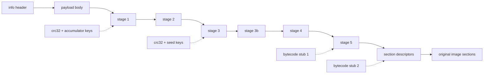

# The staged loader

The payload body decrypted by the [rolling XOR chain](primitives.md#the-rolling-key-family) is not the program — it is the loader's own world: configuration tables, encrypted stage code, and the descriptors that will eventually recover the program's sections. The loader is **self-decrypting**: its code is split into stages, each stage encrypted with a key derived from content that only exists after the previous stage decrypted correctly. Control (or, statically, analysis) must pass through the stages in order; there is no shortcut to the final stage's tables.



## The common stage-decrypt shape

Every stage after stage 2 is decrypted with the same composite, defined by a `(src, src_len, dest, dest_len)` quad in the buffer:

1. **AES-CBC decrypt** `src..src+src_len` with the stage AES schedule (`key_offsets[3]`).
2. **XOR + rotate-right** over the descriptor with the stage key ([xor_ror_dwords, shift 19](primitives.md#xor--rotate-right-dword-cipher)).
3. If a per-build bytecode stub applies, translate every byte through it.
4. If `src_len != dest_len`, **Huffman/LZ-decompress** `src → dest` with the stage Huffman table (`key_offsets[1]`).

Stages 3–5 are just this composite applied to quads at computed offsets with keys from the checksum chain.

## The 64-bit EXE flow (marker layout)

This is the reference flow; the other families are variations on it. It proceeds in nine numbered phases.

### Phase 1–2: header and payload

Derive `info` with the [KDF](file-format.md#the-info-header-and-its-key-derivation), verify the magic, allocate a zeroed image buffer of `SizeOfImage` bytes, run the [payload XOR chain](primitives.md#the-rolling-key-family) over `decrypt_size = info[6] - info[3] + 8192` bytes, copy the remaining `info[5] - decrypt_size` bytes verbatim, and overlay the first 4096 header bytes.

### Phase 3: the configuration anchor

The configuration block floats between builds, so it is located by scanning the region `[info[6] + 1000, info[6] + 8000)` for the **anchor**: a dword equal to `info[3]`, followed at `+8` by a value slightly less than `info[6]` (delta ≤ `0x1000`, a multiple of `0x200`). A build-generation discriminator follows: the config-version stamp sits at `anchor + 104` in the older layout and `anchor + 112` in the newer one (its top nibble is always `0x4`), yielding `anchor_extra ∈ {0, 8}` — every field from offset 40 onward shifts by that amount.

From the anchor:

- The import directory `(RVA, size)` is restored into the PE header from `anchor + 8` / `anchor + 4`.
- A walk over the `(offset, length)` descriptor table at `anchor + 184 (+extra)` accumulates `xor_acc` — the XOR of every region's `crc32 ^ length` checksum.
- **Stage 1** is unwrapped with `xor_ror_dwords(anchor + 120 (+extra), xor_acc ^ chk1 ^ v, 21)`, where `chk1` is the checksum of the region described at `anchor + 56 (+extra)` and `v` is the dword at `anchor + 20`.

### Phase 4: stage 2

Inside stage 1, the stage-2 quad is the unique 16-byte entry where `d0 == d2`, `d0` lies in the payload range, `d1 > 0x10000`, and `0 < d3 < d1` — call its offset `stage2_off`. Walking back from it, `chk_src_start` is the first position where four consecutive `(src, len)` pairs are all plausible. The stage-2 key is the dword at `chk_src_start - 20`, and stage 2 is unwrapped with shift 19.

Inside stage 2, a 16-byte entry `(1, 0, info[3], 0)` marks `table_start`; the **head** table is at `table_start + 32` and **walk2** at `head - 88`. The two head entries dispatch on their kind dword: kind `1` (or `0x11` — the upper nibble is a build stamp) runs `byte_rotate3` over a descriptor; kind `2` walks a `(src, len, dst, chk)` copy list, moving already-decrypted regions to their working positions. The walk2 entries then yield the four **key offsets** (each `byte_rotate3`-decrypted):

| Slot | Role |
| --- | --- |
| `key_offsets[0]` | Huffman table for **section data** blocks |
| `key_offsets[1]` | Huffman table for **stage** decompression |
| `key_offsets[2]` | AES key schedule for **section data** blocks |
| `key_offsets[3]` | AES key schedule for **stage** decryption |

### Phase 5: stages 3, 3b, 4, 5

Each stage's quad sits at a fixed offset past `stage2_off`, and each key mixes the running `xor_acc`, a fresh checksum, and a seed recovered from the stage decrypted just before:

| Stage | Quad offset | Key composition |
| --- | --- | --- |
| stage 3 | `stage2_off + 88` | `xor_acc ^ chk2 ^ accum` — `accum` is a dword from `chk_src_start - 16` run through four rounds of the [triangular schedule](primitives.md#the-triangular-key-schedule) |
| stage 3b | `stage2_off + 104` | `xor_acc ^ chk3 ^ v4` — `v4` is the last nonzero dword of stage 3, anchored by the `C3 CC CC CC` (function epilogue + `int3` padding) before it |
| stage 4 | `stage2_off + 136` | `xor_acc ^ chk4 ^ ~v5` — `v5` is the dword 8 bytes before the first `"Virtual..."` API-name string in stage 3b |
| stage 5 | `stage2_off + 216` | `xor_acc ^ chk4 ^ chk5 ^ accum2`, plus bytecode stub 1 |

Stage 4 is where the first embedded **bytecode stub** appears. Its neighbors are the anti-debug API name strings (`IsDebuggerPresent`, `CheckRemoteDebuggerPresent`); the stub itself is located by [trial LFSR-decoding and parsing](primitives.md#the-per-build-bytecode-permutation) rather than a fixed offset. The `accum2` seed sits after the last occurrence of the byte pattern `48 EB 01 B9` (plus any `CC` padding), advanced through three triangular rounds. Stage 5 is the only stage decrypted through a bytecode stub — stub 1 is baked into its transform.

### Phase 6: the stage-5 tables

Stage 5 holds the tables that recover the program sections. In the marker layout they hang off two byte markers:

- `70 6D 00 00 63 6D 00 00` (`"pm\0\0cm\0\0"`) — names the `pm`/`cm` submodule codes.
- `00 00 00 40 01 00 00 00` — the "kind marker" (dword pair `0x40000000, 1`).

Relative to the kind marker: **walk4** (the section-load descriptor table pointer) at `−0x20`, **walk3** (a checksum chain) at `−0x18`, and **walk5** (the import-name pointer table) at `+8`. The second **bytecode stub** sits at a discovered offset (marker `+960` in the oldest builds; trial-located otherwise), with the **file checksum chain** pointer `0x58` bytes before it.

- **walk3** is *validation-only*: its 16-byte entries are transiently decrypted, fed into a chained CRC-32 over the original file bytes, and then **restored to their encrypted form** — the chain exists to detect tampering, not to produce output.
- The **file checksum chain** is decrypted permanently in place (16-byte `byte_rotate2` entries until a zero length).
- Stub 2 is LFSR-decrypted and parsed into the op list applied to every section block.

### Phase 7: section recovery

The walk4 table is a positional chain of 16-byte descriptors — each `byte_rotate2`-decrypted in place — of the form `(src, len, dst, plain_len)`, ending on a zero `len`. Per block:

```
copy file[src + section_data_file_base .. +len] → image[dst]
aes_decrypt(dst, len, key_offsets[2])
translate dst..dst+len through bytecode stub 2
if len != plain_len: huffman_decompress(dst → dst, key_offsets[0], len, plain_len)
```

`section_data_file_base` is the complement-encoded base from [the file format page](file-format.md#locating-section-data-in-the-file). A second walk4 chain then lists regions to zero-fill (the `.bss`-equivalent). Because blocks write disjoint image spans and read only immutable file bytes, this phase is embarrassingly parallel — a property of the format, not of any tool.

### Phase 8: import-name decryption

walk5 entries (20 bytes each) point at encrypted DLL names (`+12`) and thunk chains (`+0` or `+16`). Each name is decrypted with the [string cipher](primitives.md#the-import-name-string-cipher), lowercased, and each by-name thunk (bit 63 clear on PE32+) has its hint/name string decrypted and its hint field zeroed. Ordinal imports (bit 63 set) are left alone.

### Phase 9: PE reconstruction

The final phase rebuilds the PE header — section table conversion, the encrypted entry-point/data-directory block, TLS handling, `/FIXED` policy, the code-page scramble, and managed-metadata handling. These are format transformations rather than loader stages, covered in [PE transformations](pe-transformations.md).

## The 32-bit (PE32) flow

The 32-bit family shares the header/payload phases, then diverges completely: different anchors, an extra stage generation, and brute-forced parameters where the 64-bit flow uses fixed ones.

**The `tbl` anchor.** Located by scanning the shell region near `info[6]` for a dword equal to `info[6]` followed by a plausible shell size; the anchor is `0x88` bytes earlier. Import/resource directories are restored from `tbl + 0xBC/0xC8/0xCC`, and the **header checksum** — an XOR of `calculate_checksum` over the descriptor chain at `tbl + 0x58` — becomes a key component of every later stage. Note the consequence: stage keys depend on the *original pre-pack PE header's* checksum.

**SecondStage.** The `(offset, size)` pair at `tbl + 0x98` is unwrapped with `ss_key = header_checksum ^ first_stage_cs ^ second_stage_key` (shift 21). The constant `ss_shift = ss_size − 0xBC0` then parameterizes *every* subsequent offset — a deliberate per-build permutation of the whole stage layout. Native DLLs carry a packer-added BaseReloc data directory that the original header lacked, so the header checksum only matches with that entry zeroed; both variants are tried and the one whose ThirdStage pointer validates wins.

**ThirdStage.** The rotate shift is not recorded; it is brute-forced over `[19, 21, 17, 23, 15, 25, 13, 11]`, accepting the shift whose output contains the info-table signature (a `1`/`0x11` entry followed by a `2` entry with a plausible address). The four key offsets live `0x58` bytes before the info table, decrypted as in the 64-bit flow.

**Fourth/Fifth/Seventh.** Unwrapped from quads at `dp_base + 0x40/0x50/0x70` with keys of the form `header_checksum ^ crc32(previous region) ^ advance_key(seed)`, where each seed comes from the stage decrypted just before. The Seventh stage contains the first **bytecode stub** (located by backward-then-forward LFSR scan).

**EighthStage and its key search.** The Eighth stage key is not stored either: candidates are collected from gap heuristics around the stub (end-of-region gaps `0xD0…0x100`, stub-relative gaps, and a linear scan for non-printable dwords), each run through `advance_key(raw, 3)`, and each tried against the full stage-decrypt composite. The winner is the candidate whose result **decompresses cleanly and points inside the image** — the Huffman decoder's success/failure signal used as an oracle.

**The configuration cluster.** The Eighth stage holds the final table cluster at fixed offsets from a base: import table `+0x18`, file checksum chain `+0x30`, section descriptors `+0x40`, zero-fill list `+0x48`, and the file-data **bytecode stub** at `+0x4B4`. Classic builds stamp the base with the dword `0x00007679` (a build-version value that recurs in driver names — see [Kernel drivers and submodules](kernel-components.md)); builds without the stamp are located by the checksum-chain slot's shape (a pointer just past `info[3]` with a small 16-aligned size).

**The file decryptor, proven.** The file-data bytecode stub is not trusted to the nearest scan hit: each candidate is validated by replaying the first *compressed* block's full transform (copy → AES → translate → decompress) on a snapshot and requiring decompression to succeed. Coincidental LFSR-shaped blocks that decode to a wrong translate exist in real builds — one sits a few dozen bytes before the real stub in an observed 32-bit family — so trial-and-validate is the only safe selection.

**Output.** The 32-bit flow ends with section-table fixups, the code-page scramble (formula chosen by the `0xCC` statistic), import rebuilding (with the `.kmiat` relocation for EXEs), TLS reconstruction, and a compaction pass that repacks the RVA-laid image into a file-aligned PE. Details in [PE transformations](pe-transformations.md).

## The dedicated DLL layout (older DLLs)

The older protected-DLL layout runs the same primitives but pins the configuration block to a **fixed anchor** at `keys[6] + 5592` — no scan. Every field is a fixed offset from it:

| Anchor offset | Contents |
| --- | --- |
| `+4` / `+8` | Import directory size / RVA |
| `+20` | Main descriptor encryption key |
| `+40` / `+44` | Resource directory RVA / size |
| `+48` / `+56` | Checksum descriptors (checksum2 / checksum1) |
| `+120` | Main descriptor → primary stage table |
| `+184` | XOR-accumulator checksum chain |

The stage chain then runs: primary table (shift 21) → secondary table at `+3632` (shift 19, keyed by the dword at `+3444`) → two relocation blocks at `+9248` (kind `1`/`0x11`: in-place rotate-by-3 cipher over a descriptor; kind `2`: a `(src, size, dst, verify)` copy walk whose 16-byte entries are decrypted with the rotate-by-2 cipher) → four decompression parameters at `+9160` → code blocks 1–4 at `+3712/+3728/+3760/+3840`, each with checksum-chained keys (four- and three-round triangular accumulations included) → two bytecode stubs (at `addr4 + 3200` and `metadata + 88`) → the section descriptor walk at `addr5 + 11976`.

Two details are unique to this family:

- Section descriptors store `(dest, size, src, expected_crc)`; the on-disk base is `section_image_base = 4095 − u32@0x1080`, and blocks decompress only when `size != expected_crc`. (The field is reused as the decompressed size, not a CRC.)
- The PE header metadata is delivered as a 656-byte blob at `keys[3] + 16`, decrypted with the position-keyed rotate-by-2 cipher (the same construction as [byte_rotate2](primitives.md#triple-byte-rotation-ciphers)): the entry point sits `0x10` into the blob and the full 128-byte data-directory array `0x20` into it; both are copied into the PE header (`pe + 40` and `pe + 136`).

Managed DLLs in this family additionally pre-fill the section containing the CLR header from the original file before section recovery, and recopy the COR20 region afterwards — the CLR structures are preserved, not encrypted.

## The marker-less layout (newer 64-bit builds)

Newer builds drop both stage-5 markers, so the walk3/walk4/walk5 slots cannot be derived from them. The layout is instead discovered structurally:

1. **Collect every LFSR-wrapped bytecode block** in the final stage (trial-decode and parse each candidate, advancing by one byte after each hit — a false positive can sit immediately before the real stub, and fixed-stride skipping would jump over it).
2. **Pick the file decryptor** as the block whose checksum-chain pointer (`block − 0x58`) lands the smallest positive distance past `info[3]`.
3. **Find the section-descriptor table** by scanning pointer slots near the stub and trial-decrypting their targets with `trial_byte_rotate2` until one parses as a plausible `(src, src_len, dst, dest_len)` descriptor.
4. **Prove the choice**: replay the first compressed block's full transform under the selected stub and require decompression to succeed.

Other differences from the marker layout: the validation-only walk3 chain is absent; imports are rebuilt from the PE import directory rather than the walk5 pointer table; the entry-point/data-directory block uses "Layout B" placement; and the code-page scramble runs *after* the managed-metadata restore (see [PE transformations](pe-transformations.md)). These builds also keep their relocation tables and ASLR flags — they are not `/FIXED`.

## Why everything is scanned, and how wrong answers are avoided

A recurring design fact: almost nothing in the container is at a constant offset across builds. The packer permutes table placements (and on 32-bit even parameterizes them with `ss_shift`), omits markers in newer generations, and emits decoy-shaped data — coincidental bytecode-valid blocks, plausible-looking pointers. The loader itself never searches (it knows its own layout); any static reader must.

The reliable pattern is **trial-and-validate, never trust the first match**:

- Structural oracles: the anchor dword equal to `info[3]`, the `(1, 0, info[3], 0)` table signature, descriptor shape checks.
- Content oracles: the config-version stamp's top nibble, the `C3 CC CC CC` epilogue anchor, API-name strings.
- Cryptographic oracles: checksum fields that only match after correct decryption, and the Huffman decoder's clean/fail signal — the strongest, since a wrong key essentially never produces a stream that decompresses to exactly the expected size.

A wrong choice caught by an oracle falls through to the next candidate; a wrong choice *without* an oracle produces a silently broken image, which is worse than an error. Every selection point in the flows above has at least one oracle — a property worth preserving in any analysis of this format.
