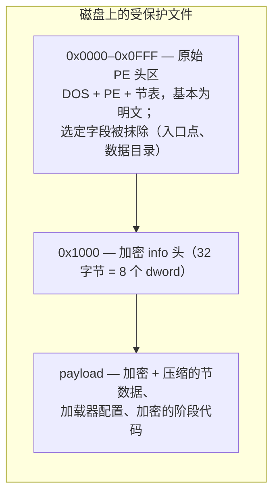

# 受保护文件格式

受保护文件是一个原始映像已被加密容器替换的 PE 文件。容器在文件前部保留原始 PE 头（基本可读），在固定偏移处以密钥派生函数隐藏一个小参数块，其余一切——程序的节与加载器自身的代码——都以加密且通常压缩的 payload 形式存储。

## 容器布局



有三个区域需要关注：

| 区域      | 文件偏移            | 内容                                                                |
| ------- | --------------- | ----------------------------------------------------------------- |
| 头区      | `0x0000–0x0FFF` | 原始 PE 头。DOS/PE 签名、COFF 头、可选头与节表以明文幸存，但入口点、若干数据目录与节原始数据指针被抹除或改作他用。 |
| info 头  | `0x1000`        | 32 字节：八个 dword，以下面的密钥派生函数加密。这是整个容器的主参数块。                          |
| payload | `0x1020` 起      | 原始映像被加密（并经 Huffman 压缩）的节数据、加载器配置表，以及加载器自身的分阶段代码。                  |

恰好在 4096 字节（`0x1000`）处的分界在所有已观察构建中恒定——包括本页末尾描述的外置伴生体布局，它正是在这个精确边界上拆分文件的。

## info 头及其密钥派生

偏移 `0x1000` 处的八个 dword 用一个滚动密钥 KDF 解密。`info[0]` 直接存储；后续每个单元都与一个滚动密钥异或，该密钥混入单元值与索引平方向前滚动：

```python
def header_kdf(file_data, offset=4096):
    info = [0] * 8
    info[0] = get_u32(file_data, offset)
    k = info[0]
    for i in range(7):
        cell = get_u32(file_data, offset + 4 + 4 * i)
        info[i + 1] = k ^ cell
        k = (i * i) ^ ((k + cell - i) & 0xFFFFFFFF)
    return info
```

同一 KDF 适用于所有构建家族——EXE 与 DLL、32 位与 64 位——因此一条代码路径即可识别所有受保护文件。解密后的字段驱动整个解包过程：

| 字段        | 含义                                         |
| --------- | ------------------------------------------ |
| `info[0]` | 种子密钥（明文存储；同时喂给 payload 密码）                 |
| `info[1]` | **格式 magic**——标识保护构建（见下文）                  |
| `info[2]` | 保留/变体                                      |
| `info[3]` | 重建映像中放置 payload 的基址 RVA                    |
| `info[4]` | payload 源偏移：payload 起于文件内 `info[4] + 4096` |
| `info[5]` | payload 总大小（拷入映像 `info[3]` 处的字节数）          |
| `info[6]` | 解密区结束标记；加载器配置块相对它定位                        |
| `info[7]` | 保留/变体                                      |

因此 payload 的搬运为：文件区间 `[info[4] + 4096, info[4] + 4096 + info[5])` → 映像区间 `[info[3], info[3] + info[5])`。前 `decrypt_size = info[6] - info[3] + 8192` 字节以滚动 XOR 链解密（见数据变换原语）；其余原样拷贝。随后文件前 4096 字节被覆盖回映像作为其头部。

### 格式 magic

`info[1]` 是构建的戳记。已知三个取值：

| magic（LE 字节） | 值            | 状态                     |
| ------------ | ------------ | ---------------------- |
| `KONN`       | `0x4E4E4F4B` | 本文档完整覆盖                |
| `KNKN`       | `0x4E4B4E4B` | 容器算法一致；构建戳不同           |
| `CUSN`       | `0x4E535543` | 已知的第三种戳，布局不兼容；不在本文档范围内 |

## 识别与分类

受保护模块不一定带 `.exe`/`.dll` 文件名——野外存在改名副本（例如 `.bak`）——因此识别必须基于内容。满足以下条件即为 Crackproof 保护文件：

1. 至少 4128 字节长，且 `e_lfanew`（`u32@0x3C`）处有有效 `PE\0\0` 签名。
2. 对偏移 4096 应用 KDF 得到 `info[1] ∈ {KONN, KNKN}`。

分类则使用常规 PE 字段：

* `IMAGE_FILE_HEADER.Characteristics & 0x2000`（`IMAGE_FILE_DLL`）区分 DLL 与 EXE。
* 对 DLL，COM 描述符（CLR）数据目录——第 14 项，位于可选头 PE32 `+96` 或 PE32+ `+112` 处——区分托管（.NET）与原生。

```python
MAGIC_KONN = 0x4E4E4F4B  # the two supported shell stamps...
MAGIC_KNKN = 0x4E4B4E4B  # ...identical algorithm, different build stamp

def detect(file_data):
    """Return ("exe" | "native-dll" | "managed-dll", magic) for a protected
    file, or None when the file is not protected by this scheme."""
    if len(file_data) < 4128:
        return None
    pe_off = get_u32(file_data, 0x3C)
    if file_data[pe_off:pe_off + 4] != b"PE\0\0":
        return None
    info = header_kdf(file_data)
    if info[1] not in (MAGIC_KONN, MAGIC_KNKN):
        return None

    characteristics = get_u16(file_data, pe_off + 4 + 18)   # IMAGE_FILE_HEADER
    if not characteristics & 0x2000:                        # IMAGE_FILE_DLL
        return ("exe", info[1])

    opt_magic = get_u16(file_data, pe_off + 24)             # 0x10B / 0x20B
    dd_base = 112 if opt_magic == 0x20B else 96
    clr_rva = get_u32(file_data, pe_off + 24 + dd_base + 14 * 8)
    return ("managed-dll" if clr_rva else "native-dll", info[1])
```


用错数据目录基址（96 与 112）会读错 dword，把 32 位原生 DLL 误判为托管。必须先读可选头 magic。


## 构建家族

野外观察到的受保护文件沿四条轴变化，各轴相互独立，所有组合都需要处理。

**位宽。** PE32+（可选头 magic `0x20B`，64 位）与 PE32（`0x10B`，32 位）容器共享头部/payload 层，但使用完全不同的配置布局、阶段结构与最终 PE 修补。

**对象种类。** EXE、原生 DLL 与托管 DLL（见上文分类）。托管映像还额外携带 CLR 结构（COR20 头与 BSJB 元数据流），加壳器将它们原样保留在受保护文件中。

**配置布局。** 64 位加载器配置有两代：

* **标记布局**（较旧构建）在加载器最终阶段内嵌字节标记 `70 6D 00 00 63 6D 00 00`（`"pm\0\0cm\0\0"`——加载器的双字母子模块代码）与 `00 00 00 40 01 00 00 00`（一个 `0x40000000, 1` dword 对）。每张重要的表都位于这些标记的固定偏移处。
* **无标记布局**（较新构建，包括以 EXE 风格外壳包裹的 DLL）省略两个标记；同样的表通过结构化方式发现——扫描内嵌字节码 stub，并对候选描述符表试解密，直到某张通过校验。

**DLL 打包方式。** DLL 有两种保护形态：

* **专用 DLL 布局**（较旧）：DLL 专属容器，其配置块位于固定偏移（`keys[6] + 5592`），无需扫描锚点。
* **EXE 风格外壳**（较新）：DLL 被套上与 EXE 相同的外壳布局。下面的外置伴生体拆分即属于这一家族。

## 在文件中定位节数据

加载器表内的节内容描述符存储的偏移，相对于一个本身以补码编码在文件偏移 `0x1080` 处的基址：

```
section_data_file_base = (~u32@0x1080) + 0x1000      （32 位回绕）
```

因此描述符的 `src` 字段映射到文件偏移 `src + section_data_file_base`。同一公式出现在所有构建家族中（在加载器代码里既称 `rebase` 又称 `compress_data_offset`）。

## 外置伴生体布局（`._` 文件）

某些构建——目前仅在 il2cpp 作品上观察到——把受保护模块拆成一对文件：

* **`Foo.dll`**——磁盘上的瘦**加载器 stub**。其代码节被裁剪到只剩一页（即 Crackproof 加载器本体），但其头部与 `.rdata` 是完整明文。
* **`Foo.dll._`**——全加密的**伴生体**，持有真正的 payload。它不含任何明文 PE 结构（熵 ≈ 8 比特/字节）。

伴生体逐字节等于 stub 自 Crackproof 头部（偏移 4096）起的 payload 区。运行时加载器映射 `Foo.dll._` 并对其执行常规解包；实际运行的模块实际上就是拼接体 `stub[..4096] ++ companion`。

配对关系由 32 字节精确匹配确认：`stub[4096..4128] == companion[0..32]`。这 32 字节覆盖加密 info 头（密钥表与 magic），因此匹配即证明该伴生体就是此 stub 的 payload，而非无关文件。

stub 以明文保留的内容对后续重建很重要：

* **导出目录**（伴生体在此处解密为密文；加载器运行时从 stub 的副本重建导出）。
* **TLS 目录**——`IMAGE_TLS_DIRECTORY` 结构体、其原始数据模板与数据目录项，这些都被加壳器从加密 payload 中剥离（见 PE 变换）。
* 真实的 `DllCharacteristics` 字段与基址重定位表——伴生模块**不是** `/FIXED`，与较旧的单文件构建不同。

关于此文件对在启动时如何加载，见运行时行为；关于缺失部分如何被还原进重建映像，见 PE 变换。
